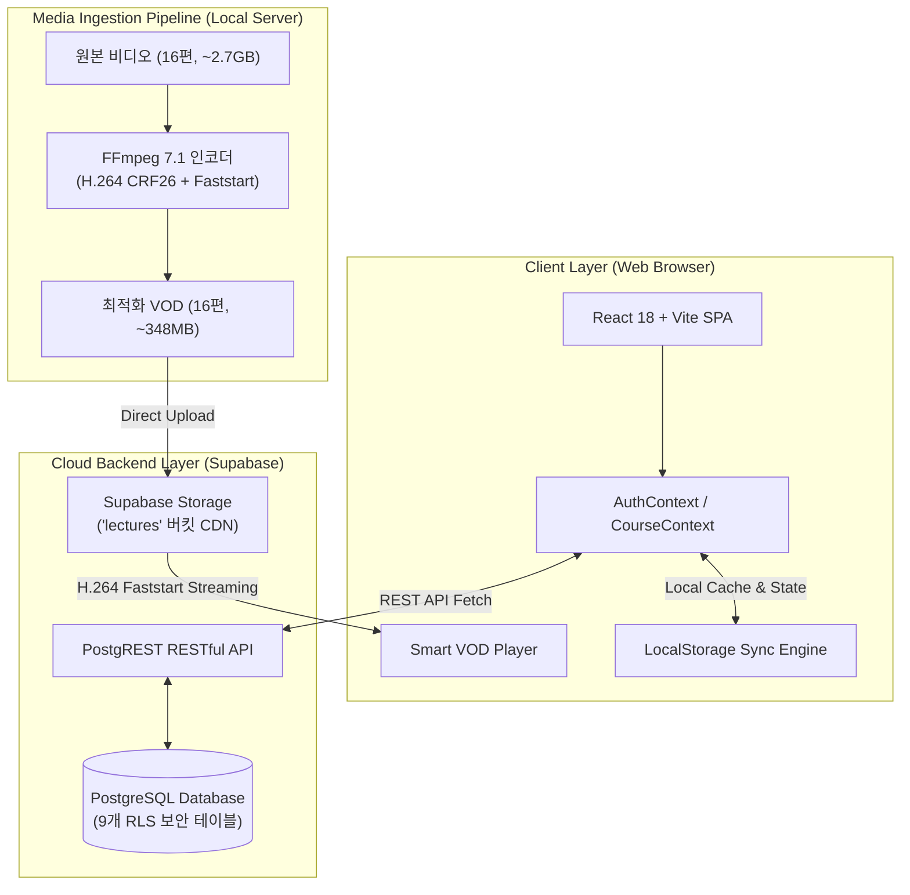
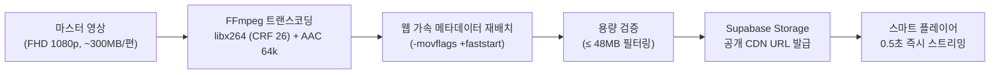
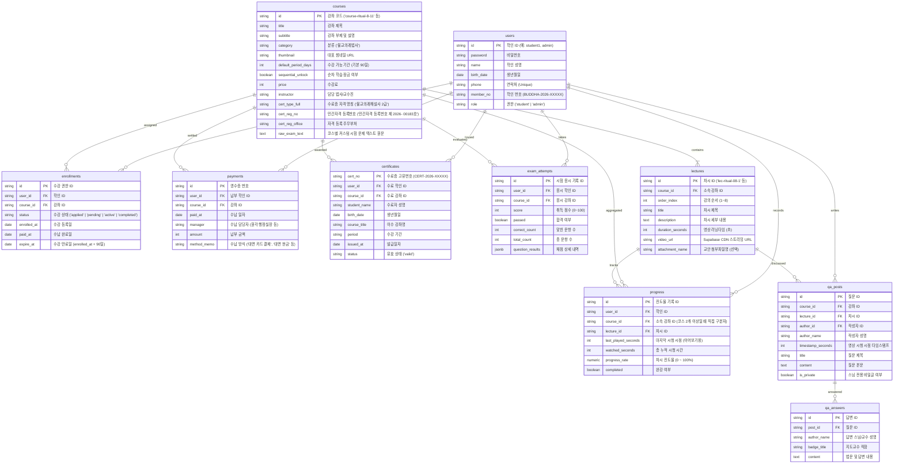
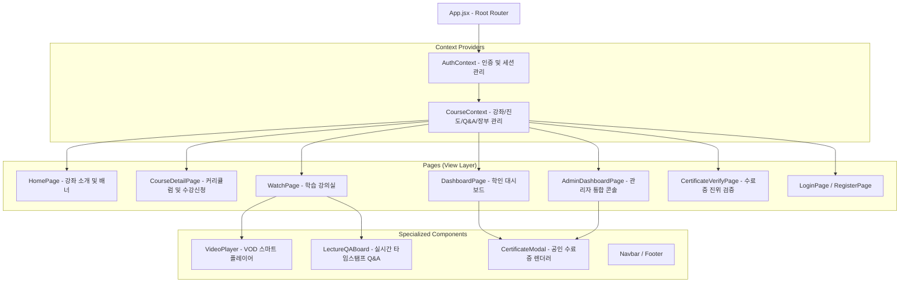

# 원각 불교 아카데미 온라인 LMS 시스템 설계서 (System Architecture Blueprint)

본 문서는 **불교의례법사 VOD 온라인 강좌 플랫폼**의 전반적인 소프트웨어 아키텍처, 데이터 모델링, 미디어 트랜스코딩 파이프라인, 프론트엔드 컴포넌트 구조 및 보안/수료증 발급 체계를 정의한 종합 시스템 설계서입니다.

---

## 1. 시스템 아키텍처 개요 (High-Level Architecture)

플랫폼은 클라이언트 중심의 **React SPA(Single Page Application)**를 기반으로 하며, 백엔드는 **Supabase Serverless(PostgreSQL + PostgREST + Cloud Storage)**를 결합한 하이브리드 클라우드 아키텍처로 설계되었습니다.



---

## 2. 미디어 트랜스코딩 & VOD 스트리밍 파이프라인

수강생들의 원활한 시청과 클라우드 용량 한계를 극복하기 위해 설계된 전용 미디어 처리 체계입니다.



### 트랜스코딩 기술 표준
| 파라미터 | 설정값 | 설계 목적 |
| :--- | :--- | :--- |
| **비디오 코덱** | `H.264 (libx264, High Profile, Level 4.1)` | 브라우저 및 모바일 환경 100% 호환 |
| **해상도** | `1920 × 1080 (Full HD)` | 불교 경전/의식 슬라이드 텍스트의 선명도 무손실 보존 |
| **비트레이트 제어** | `CRF 26 (Preset: veryfast)` | 슬라이드 정적 화면 특성을 활용하여 **용량 약 85% 감축** |
| **오디오 코덱** | `AAC 64kbps, 44.1kHz mono` | 법문 육성 음성 대역 명료도 최적화 |
| **스트리밍 최적화** | `-movflags +faststart` | `moov` 메타데이터 아톰을 파일 최상단 배치하여 **0.5초 즉각 재생** |
| **단일 파일 상한** | `&le; 48.0 MB` | Supabase Free 플랜의 50MB 파일 업로드 한계 완벽 충족 |

---

## 3. 데이터베이스 스키마 및 관계도 (ERD)

데이터베이스는 총 10개 핵심 엔티티로 구성되어 있으며, 수강생 관리, 진도율 추적, 대면 수납 장부, 질의응답, 공인 수료증 발급 및 자격 시험 채점 대장을 관장합니다.



### ※ 복수 강좌(2개 이상) 수강 시 진도율 및 이어보기 구분 메커니즘
1. **차시 고유성 (Primary Distinction)**:
   - 각 강의 차시(`lecture_id`)는 반드시 단 하나의 강좌(`lectures.course_id`)에 귀속됩니다. (예: `lec-ritual-08-1`은 코스 I, `lec-ritual-12-1`은 코스 II)
   - 따라서 `(user_id, lecture_id)` 쌍만으로도 소속 코스가 고유하게 식별됩니다.
2. **직접 강좌 외래키 (`progress.course_id`) 추가 적용 (Direct Partitioning)**:
   - 다중 강좌 수강 환경에서 `lectures` 테이블을 매번 JOIN하지 않고도, `progress` 테이블 단독으로 `WHERE user_id = ? AND course_id = ?` 쿼리를 실행해 특정 코스의 진도율과 이어보기 시점을 즉시 추출할 수 있도록 `course_id` 컬럼을 직접 보유합니다.
```

---

## 4. 프론트엔드 모듈 계층 구조 (Frontend Architecture)

React 기반의 정갈한 컴포넌트 계층으로 설계되었으며, 상태는 Context API를 통해 단일 진실 공급원(Single Source of Truth)으로 관리됩니다.



---

## 5. 주요 기능별 세부 설계 명세

### ① VOD 스마트 플레이어 (`VideoPlayer.jsx`)
* **이어보기 알고리즘**: 강좌 진입 시 `lastPlayedSeconds`가 10초 이상이고 미완강 상태일 때 1회 팝업 안내하며, 시청 시작 또는 닫기 선택 시 플래그(`dismissedResumeRef`)를 적용하여 5초 주기 진도율 저장 시 중복 노출을 차단합니다.
* **순차 학습 잠금 (`sequential_unlock`)**:
  * 코스 설정이 `true`인 경우, N번째 강의는 (N-1)번째 강의가 완강(100%)되기 전까지 잠금 상태를 유지합니다.
  * `admin` 계정은 순차 잠금을 우회하여 전 차시를 자유롭게 검수할 수 있습니다.
* **진도율 계산 주기**: 브라우저 부하 및 불필요한 네트워크 트래픽을 방지하기 위해 재생 중 5초 간격으로 스로틀링(Throttling)하여 진도율을 갱신합니다.

### ② 공인 수료증 발급 및 진위 검증 시스템 (`certService.js`)
* **발급 요건**: 강좌에 포함된 8개 차시의 진도율이 모두 100%에 도달할 때 수료 버튼이 활성화됩니다.
* **수료증 디자인**: 연꽃 문양 및 불교 전통 직인 렌더링, 인쇄 전용 CSS 미디어 쿼리(`@media print`)를 적용하여 브라우저에서 즉시 A4 규격 출력 또는 PDF 저장을 지원합니다.
* **공개 검증 (`/verify`)**: 수료증에 인쇄된 고유 식별번호(`CERT-2026-XXXXX`) 또는 QR 코드를 통해 누구나 수료자의 성명, 강좌명, 이수 기간의 진위를 대조할 수 있습니다.

### ③ 관리자 통합 콘솔 (`AdminDashboardPage.jsx`)
* **수강생 관리 (Enrollment)**: 50명 규모의 학인 명부를 실시간 검색하고 수강 승인 및 기간 연장을 수행합니다.
* **대면 수납 장부 (Payment)**: 사찰 현장에서 이루어지는 현금, 계좌이체, 카드 결제 내역을 기록하고 영수증을 발행합니다.
* **강의 CMS (CMS)**: 차시 순서 변경, 순차 잠금 옵션 토글, 신규 영상 브라우저 직접 업로드 기능을 제공합니다.
* **Q&A 상담실 (Q&A)**: 학인 질문을 필터링하고 스님/지도교수 명의로 법문 답변을 작성합니다.

---

## 6. 보안 및 규정 준수 (Security & Access Control)

1. **Supabase Row Level Security (RLS)**:
   * 모든 9개 테이블에 RLS를 활성화하여 비인가 사용자의 임의 데이터 변조를 방지합니다.
2. **단일 기기 / 보안 세션 마킹**:
   * 비디오 플레이어 상단에 실시간 스트리밍 검증 보안 토큰(`streamToken`)을 표시하여 비인가 녹화 및 캡처를 시각적으로 방지합니다.
3. **로컬 무저장 보안 원칙 (Zero-LocalStorage Policy)**:
   * 학인 및 관리자 브라우저 디스크(`localStorage`)에는 학인 명부, 강좌 목록, 진도율, 결제 장부 등 일체의 데이터가 일절 저장되지 않습니다.
   * 앱 초기화 및 로그아웃 시 `localStorage.clear()`가 강제 실행되며, 모든 데이터는 100% Supabase Cloud DB와 실시간 직접 통신으로만 처리됩니다. 로그인 세션 또한 브라우저 창/탭을 닫으면 디스크에 남지 않고 즉시 자동 파기되는 휘발성 세션 스토리지(`sessionStorage`)로 격리되어 로컬 디스크에 어떠한 개인정보나 학습 흔적도 남지 않습니다.
