# 세화불학원 온라인 아카데미 공식 사용자 매뉴얼
> **시스템 접속 주소**: [https://buddha-academy.netlify.app](https://buddha-academy.netlify.app)  
> **시스템 목적**: 불교 인문학 및 불교 전통 의례 전문 VOD 학습, 체계적 진도율 관리, A4 단일 규격 공인 수료증 발급 및 교학처 학사 행정 시스템

---

## 📑 목차
1. [플랫폼 소개 및 메인 화면 구성](#1-플랫폼-소개-및-메인-화면-구성)
2. [회원가입 및 로그인 (계정 관리)](#2-회원가입-및-로그인-계정-관리)
3. [강좌 둘러보기 및 수강 신청 (대면 수납 접수)](#3-강좌-둘러보기-및-수강-신청-대면-수납-접수)
4. [나의 강의실 (3가지 강좌 상태 완전 분석)](#4-나의-강의실-3가지-강좌-상태-완전-분석)
5. [스마트 VOD 플레이어 학습 가이드](#5-스마트-vod-플레이어-학습-가이드)
6. [공인 수료증 발급 및 PDF 저장 / 인쇄](#6-공인-수료증-발급-및-pdf-저장--인쇄)
7. [학습 Q&A (지도 스님 / 교수 질의응답)](#7-학습-qa-지도-스님--교수-질의응답)
8. [교학처 관리자 시스템 (CMS 모드) 가이드](#8-교학처-관리자-시스템-cms-모드-가이드)

---

## 1. 플랫폼 소개 및 메인 화면 구성

**사단법인 세화불학원 온라인 아카데미**는 현대인을 위한 정갈한 불교 인문학과 전통 승가 의례의 법식을 온라인으로 시공간의 제약 없이 배울 수 있는 원격 평생교육 플랫폼입니다.

### 🌟 1.1 메인 상단 헤더 및 히어로 섹션
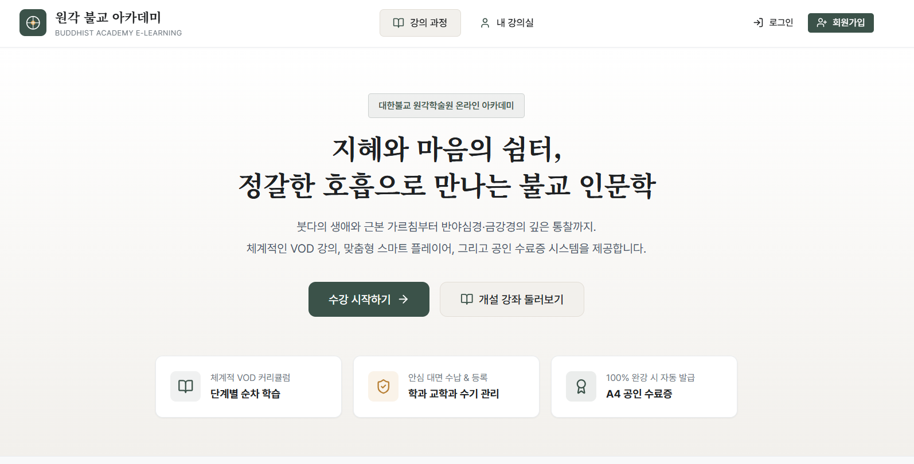

* **상단 네비게이션 바 (GNB)**:
  * **세화불학원 로고**: 플랫폼 어느 페이지에서든 클릭 시 첫 화면으로 즉시 복귀합니다.
  * **[강의 과정]**: 아카데미에 개설된 전체 전문 교육과정 목록을 살펴봅니다.
  * **[내 강의실]**: 학인이 수강 중인 강좌 현황, 진도율, 수료증을 관리하는 개인 배움터입니다.
  * **[로그인] / [회원가입]**: 계정 접속 및 신규 회원 등록 버튼입니다.
* **메인 표제**: *"지혜와 마음의 쉼터, 정갈한 호흡으로 만나는 불교 인문학"*
* **[수강 시작하기 ▶]**: 클릭 즉시 대표 교육과정 및 내 강의실로 연결됩니다.

---

### 🌟 1.2 개설 강좌 안내

* **불교의례법사 과정 I (8강~11강)**: 하단 시식, 칠칠재 영혼식, 각 칠재 의례 및 영반 실수를 체계적으로 연마하는 전문 승가 의식 과정입니다.
* **불교의례법사 과정 II (12강~15강)**: 칠칠재 막재, 세불원 포살의식, 생일권공의식 실수 및 영산수륙예수 작법을 익히는 심화 의례 과정입니다.
* 각 강좌 카드에서 수강료(180,000원 대면 수납)와 수강 인정 기간(90일)을 명확하게 확인할 수 있습니다.

---

### 🌟 1.3 플랫폼 3대 특장점 및 푸터
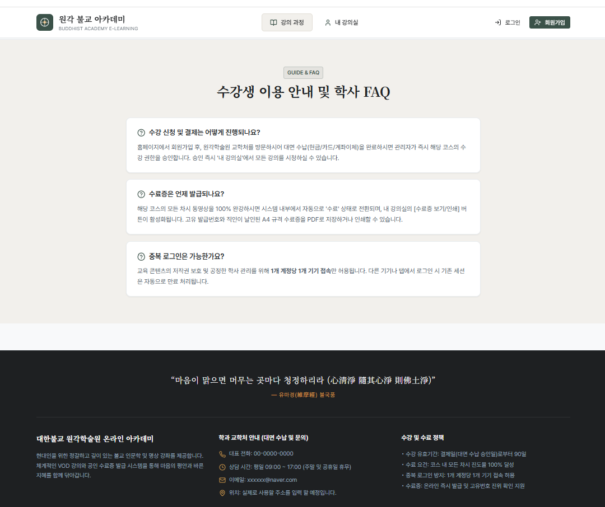

1. **체계적 VOD 커리큘럼**: 단계별 순차 학습 시스템을 적용하여 기본 차시 이수 시 다음 차시가 열리는 체계적 교육 방식 적용
2. **안심 대면 수납 & 등록**: 정통 승가 학사의 엄정한 관리를 위해 교학처 대면 수납 및 전산 수기 관리 원칙 준수
3. **100% 완강 시 자동 발급**: 전 강좌 이수 시 위조 방지 일련번호가 기재된 정식 공인 수료증 즉시 발급

---

## 2. 회원가입 및 로그인 (계정 관리)

### 2.1 신규 회원가입 (수강생 계정 생성)
온라인 아카데미를 처음 방문하신 분은 우측 상단의 **[회원가입]**을 눌러 계정을 생성합니다.

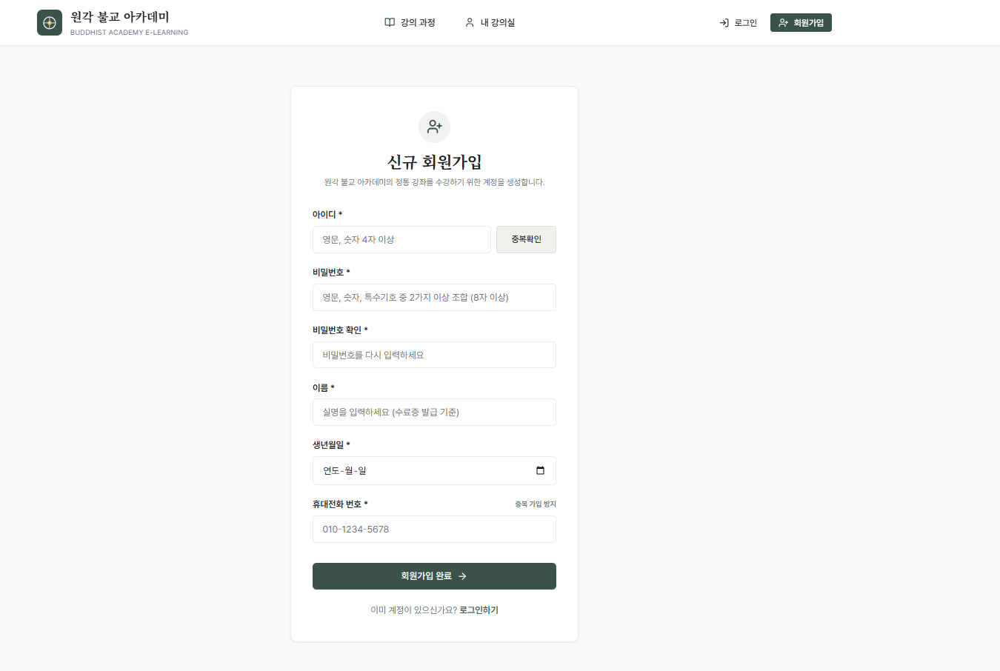

* **아이디**: 영문 소문자와 숫자로 구성된 본인 고유 아이디 (실시간 중복 검증)
* **비밀번호**: 안전한 계정 보안을 위해 **영문, 숫자, 특수문자 중 2가지 이상 조합하여 8자 이상** 설정
* **성명**: 본인의 **실명 또는 법명(스님/불자)**을 입력 (수료증에 공식 인쇄)
* **생년월일**: 수료증 기재를 위한 생년월일 8자리 선택
* **휴대전화 번호**: 본인 확인 및 학사 알림용 연락처 입력 (중복 가입 방지)

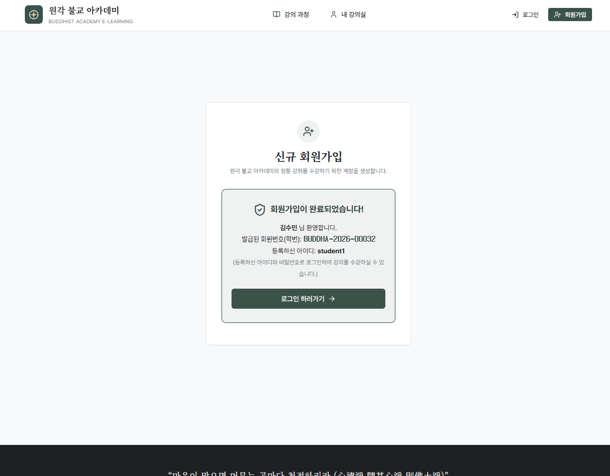

* 가입 완료 즉시 `BUDDHA-2026-XXXXX` 형태의 고유 **학번(식별번호)**이 발급됩니다.
* 학번을 확인하신 후 **[로그인 하러가기]** 버튼을 눌러 로그인 화면으로 이동합니다.

---

### 2.2 로그인
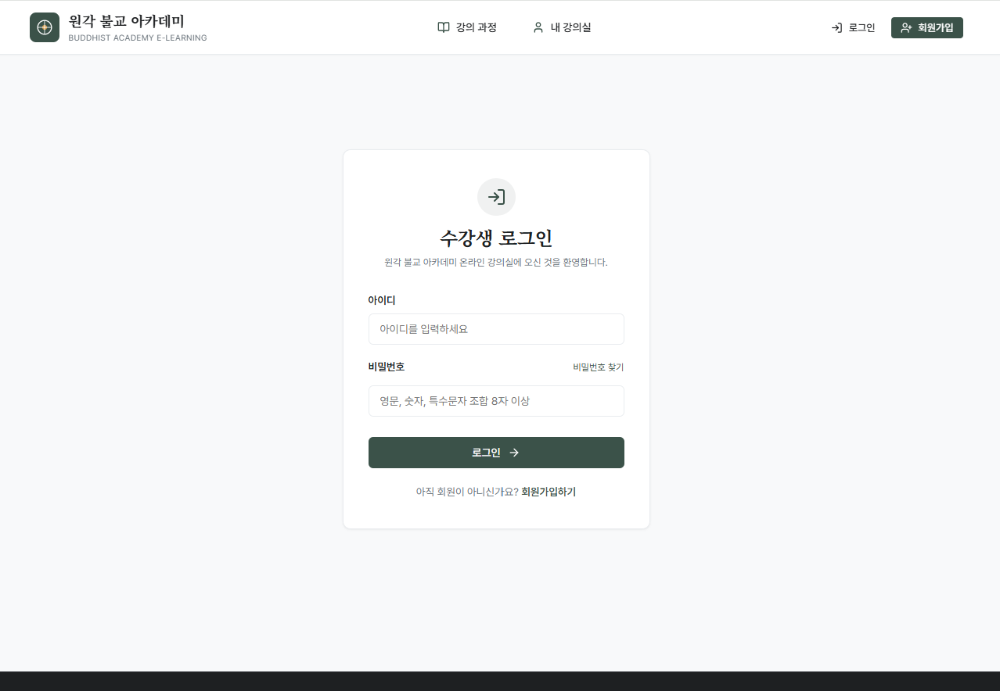

1. 우측 상단의 **[로그인]** 버튼을 클릭합니다.
2. 발급받으신 **아이디**와 **비밀번호**를 입력하고 **[로그인 →]** 버튼을 누릅니다.
3. 최고관리자 계정은 교학처 전용 안내에 따라 접속합니다.

---

### 2.3 비밀번호 재설정 (비밀번호 찾기)
비밀번호를 분실하셨을 경우, 본인 확인을 거쳐 즉시 새 비밀번호로 변경할 수 있습니다.

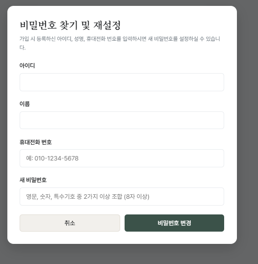

1. 로그인 카드 하단의 **[비밀번호 찾기]** 링크를 클릭합니다.
2. 가입 시 등록했던 **아이디, 성명, 휴대전화 번호**를 입력합니다.
3. 정보가 일치하면 즉시 **새 비밀번호**를 입력하여 본인이 직접 재설정할 수 있습니다.

---

### 2.4 비로그인 접속 시 [내 강의실] 접근 제한
로그인하지 않은 상태에서 상단의 [내 강의실]에 접근하면 로그인 안내 화면이 표시됩니다.

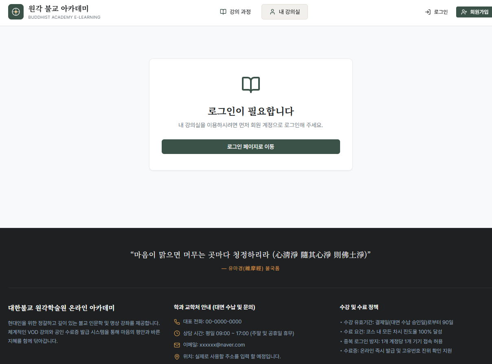

* **[로그인 페이지로 이동]** 버튼을 눌러 로그인 후 이용하실 수 있습니다.

---

## 3. 강좌 둘러보기 및 수강 신청 (대면 수납 접수)

### 3.1 강좌 상세 정보 및 커리큘럼 확인
메인 화면 또는 [강의 과정] 메뉴에서 강좌를 선택하면 상세 안내 페이지로 이동합니다.

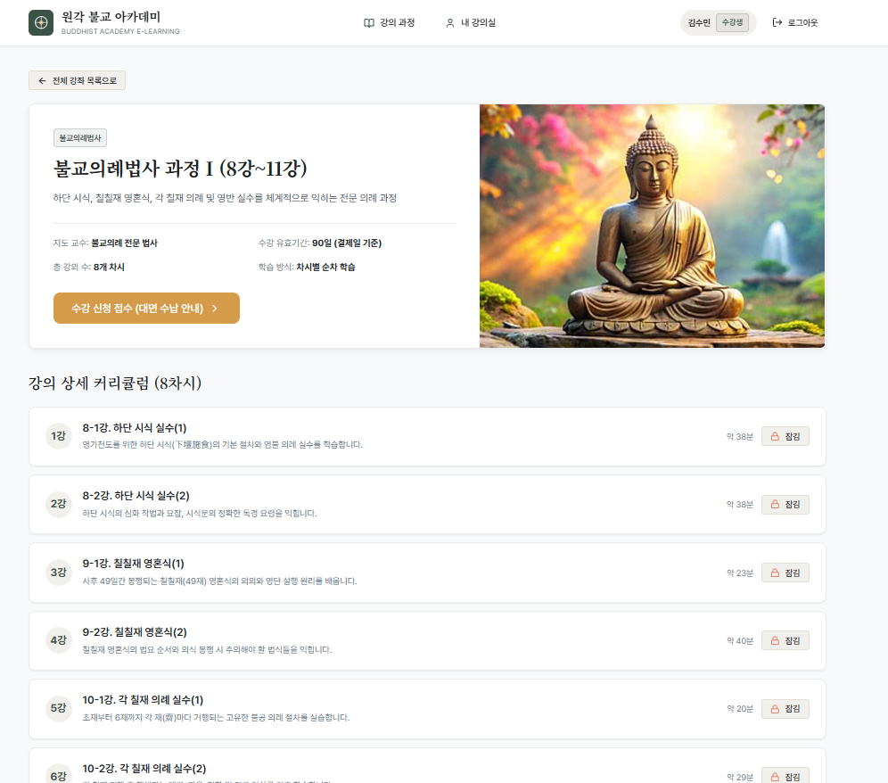

* **교육과정 기본 정보**: 지도 교수/법사, 수강 유효기간(90일), 총 강의 수, 순차 학습 방식 안내
* **상세 커리큘럼**: 각 차시별 강의 제목 및 재생시간 확인
* **수강 신청 접수**:
  * 아직 수강 권한이 없는 차시는 **[🔒 잠김]** 상태로 표시됩니다.
  * 하단의 **[수강 신청 접수 (대면 수납 안내) ▶]** 버튼을 클릭합니다.
  * 신청 접수 알림 창이 나타나며, [내 강의실]에 **[⏳ 대기상태]**로 안전하게 등록됩니다.

---

## 4. 나의 강의실 (3가지 강좌 상태 완전 분석)

로그인 후 상단 **[내 강의실]**에 접속하시면, 신청하신 모든 강좌가 3가지 상태에 따라 정확하게 표시되며 상태가 변경되기 전까지 브라우저를 새로고침하거나 재접속해도 영구 유지됩니다.

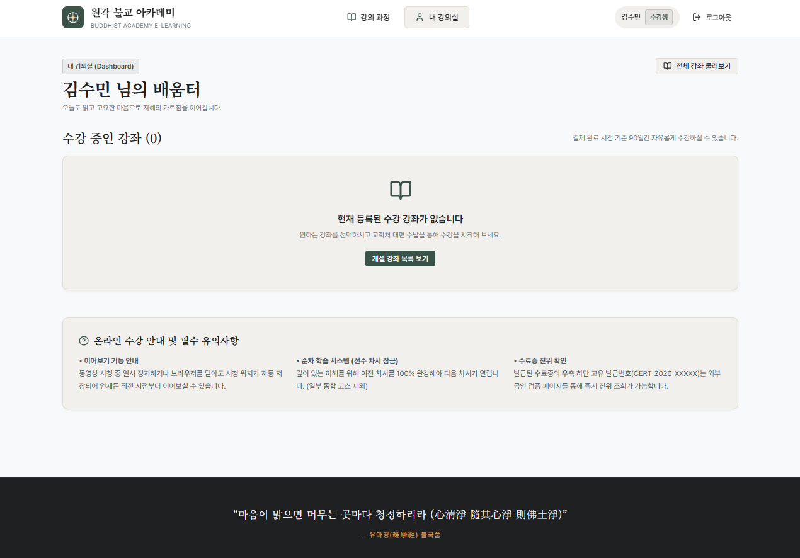

### 📊 3가지 강좌 상태 비교 요약표

| 상태 단계 | 표시 뱃지 | 카드 상단 상태 박스 | 카드 제공 기능 버튼 |
| :---: | :---: | :---: | :---: |
| **① 납부 전** | `⏳ 대기상태 (대면 수납 대기)` | **"교학처 대면 수납 승인 대기 중"** (교학처 수납 완료 시 수강 중 전환 안내) | `[대면 수납 절차 및 위치 안내]` |
| **② 납부 후** | `▶ 수강 중` | **실시간 학습 진도율(0%~99%) 프로그레스 바** **D-90일 잔여 유효기간 카운트다운** | `[강의실 입장 (학습 이어하기) ▶]` `[⚡ 100% 완강 수료 처리하기]` |
| **③ 수료 완료** | `🏆 수료 완료` | **"전 강좌 이수 완료 (진도율 100%)"** (정식 공인 수료증 발급 대상 축하) | `[🎓 수료증 발급 및 출력]` (골드 버튼) `[강의 다시 복습하기]` |

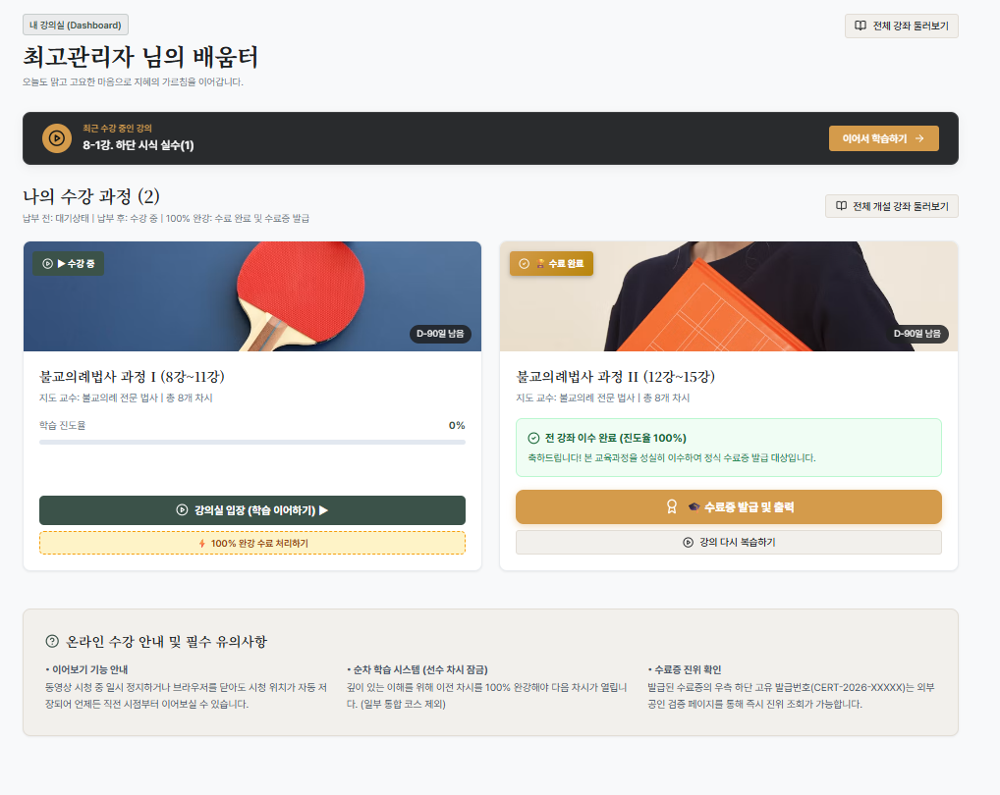

---

### 4.1 ① [납부 전] 상태: 대기상태 (대면 수납 대기)
* **표시 뱃지**: `⏳ 대기상태 (대면 수납 대기)` (황색 뱃지)
* **상태 안내 박스**:
  > **교학처 수납 승인 대기 중**  
  > 수강 신청이 접수되었습니다. 교학처 이메일(sehwaba@gmail.com) 또는 전용 계좌(케이뱅크 700-100-073619)로 수강료를 납부하시면 즉시 [수강 중]으로 전환되어 강의 시청이 가능합니다.
* **[수납 절차 및 위치 안내] 팝업 버튼**:
  * 클릭 시 교학처 방문 위치(**서울 종로구 삼봉로 81, 613호 두산위브파빌리온**), 대표 이메일(**sehwaba@gmail.com**), 수납 계좌 안내 팝업 모달이 열립니다.
* **영구 보존성**: 교학처에서 수납을 확인하여 승인하기 전까지 브라우저를 새로고침하거나 창을 닫아도 카드가 사라지지 않고 대기 상태를 유지합니다.

---

### 4.2 ② [납부 후] 상태: 수강 중 (학습 진행)
* **표시 뱃지**: `▶ 수강 중` (세이지 그린 뱃지)
* **카드 학습 정보**:
  * 썸네일 우측 하단에 **`D-90일 남음`** 유효기간 실시간 표시
  * 실시간 **학습 진도율(0% ~ 99%)** 프로그레스 바 제공
* **제공 기능 버튼**:
  * **`[강의실 입장 (학습 이어하기) ▶]`**: 클릭 즉시 VOD 플레이어로 이동하여 첫 강의 또는 직전에 수강하던 지점부터 이어봅니다.
  * **`[⚡ 100% 완강 수료 처리하기]`**: 테스트 시뮬레이터 버튼으로, 모든 차시를 즉시 100% 완강 처리하여 수료증 발급 상태를 미리 체험해볼 수 있습니다.

---

### 4.3 ③ [수료 완료] 상태: 수료 완료 (수료증 발급)
* **표시 뱃지**: `🏆 수료 완료` (골드 그라데이션 뱃지)
* **축하 안내 박스**:
  > **전 강좌 이수 완료 (진도율 100%)**  
  > 축하드립니다! 본 교육과정을 성실히 이수하여 정식 수료증 발급 대상입니다.
* **제공 기능 버튼**:
  * **`[🎓 수료증 발급 및 출력]` (대형 골드 버튼)**: 클릭 즉시 직인이 날인된 공인 수료증 모달이 열리며 즉시 인쇄 및 PDF 저장이 가능합니다.
  * **`[강의 다시 복습하기]`**: 수료 완료 후에도 유효기간 내에 언제든 1강부터 자유롭게 다시 시청할 수 있습니다.

---

## 5. 스마트 VOD 플레이어 학습 가이드

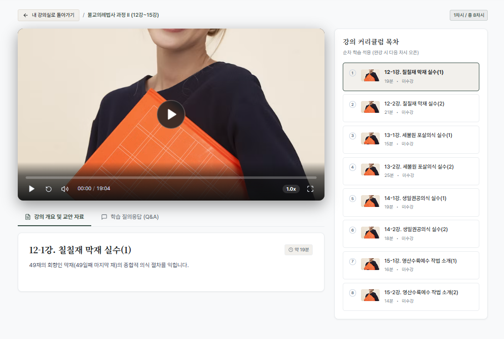

### 5.1 플레이어 주요 컨트롤러 기능
1. **1080p Full HD 스트리밍**: 전용 CDN을 통해 버퍼링 없이 선명한 고화질로 강의 시청
2. **10초 이동**: `◀ 10초`, `10초 ▶` 버튼으로 복습하고 싶은 대목을 빠르게 이동
3. **재생 배속 조절**: `0.75x`, `1.0x (표준)`, `1.25x`, `1.5x`, `2.0x` 지원
4. **전체화면 모드**: 모니터 및 스마트폰 화면 가득 대화면 시청
5. **자동 이어보기 (Smart Resume)**: 시청 중 창을 닫아도 다음 접속 시 직전 시청 지점부터 자동 재생

### 5.2 순차 학습 시스템 (차시 잠금 규칙)
* 강의의 깊이 있는 이해와 체계적 교육을 위해 **앞 차시 강의를 끝까지 시청(100% 완강)해야 다음 차시가 열립니다.**
* 수강이 완료된 차시는 우측 차시 목차에서 초록색 **[학습완료]** 체크 표시로 변경됩니다.
* 우측 상단의 첨부파일 영역에서 각 차시별 강의 교안 PDF를 다운로드할 수 있습니다.

---

## 6. 공인 수료증 발급 및 PDF 저장 / 인쇄

교육과정의 모든 차시를 100% 완강하면 정식 공인 수료증이 시스템에서 즉시 발급됩니다.

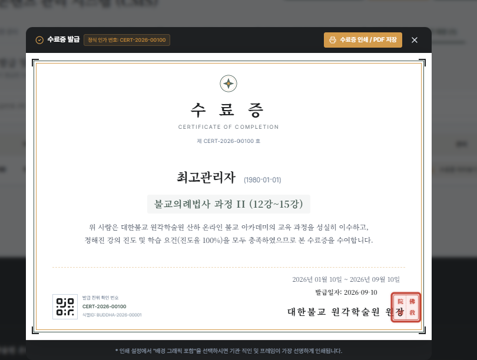

### 6.1 수료증 구성 요소
1. **상단 컨트롤 바**:
   * 정식 타이틀: **`수료증 발급`**
   * 인가 번호: `정식 인가 번호: CERT-2026-XXXXX`
   * **[수료증 인쇄 / PDF 저장]** 버튼 및 **[✕ 닫기]** 버튼
2. **수료증 본문 (고품격 A4 가로 양식)**:
   * **사단법인 세화불학원 엠블럼** 및 **수 료 증 (Certificate of Completion)** 표제
   * **인가 호수**: 제 CERT-2026-XXXXX 호
   * **성명 및 생년월일**: 수강생 실명/법명 및 생년월일 명기
   * **이수 과정명**: 수료한 교육과정 공식 명칭
   * **수료 문구**: 정해진 강의 진도 및 학습 요건(진도율 100%) 충족 증명
3. **위조 방지 진위 검증 블록**:
   * **발급 진위 확인 번호**
   * **학인 고유 식별 ID**: `SEHWA-2026-XXXXX`
4. **발행 기관 및 직인**:
   * **사단법인 세화불학원 원장** 명의 및 선명한 적색 공인 직인 날인

### 6.2 상·하단 일치 프레임 및 단일 1장(A4 Landscape) 인쇄 최적화
* **상·하단 완벽 대칭 사이즈**: 상단 검은색 바와 하단 안내 바가 수료증 본체 용지와 동일한 **860px (100%)**로 정확히 일치하여 좌우 삐져나옴 없이 완벽한 조화를 이룹니다.
* **단 1장 출력 보장 (1 / 1 페이지)**:
  * **[수료증 인쇄 / PDF 저장]** 버튼을 클릭하면 브라우저 인쇄 창이 자동으로 **A4 가로(Landscape) 규격, 여백 없음(0mm)**으로 호출됩니다.
  * 불필요한 배경 요소를 모두 배제하고 정확히 **1장의 고품질 수료증만 출력**되도록 시스템이 최적화되어 있습니다.
  * 인쇄 대상을 `PDF로 저장`으로 선택하시면 소장용 디지털 PDF 파일로 저장할 수 있습니다.

---

## 7. 학습 Q&A (지도 스님 / 교수 질의응답)

강의 시청 중 생기는 교리적 의문이나 의례 실습에 관한 질문은 전용 Q&A 게시판을 통해 질문할 수 있습니다.

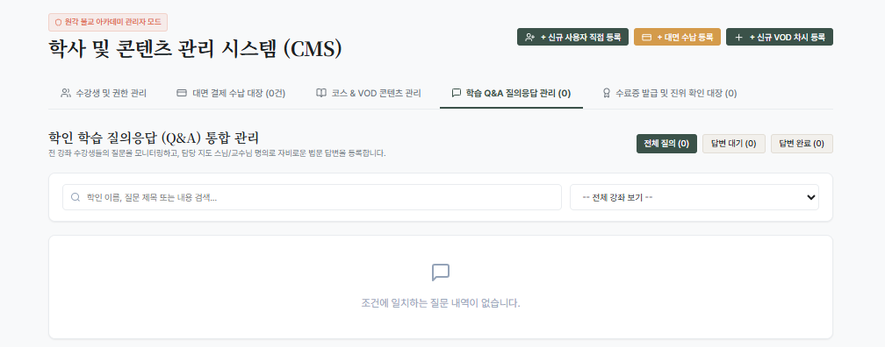

1. **질문 작성**: 강좌 및 해당 차시를 선택하고 질문 내용을 작성합니다. (신행 상담 등 비공개 질문은 **[비밀글]** 설정 가능)
2. **지도교수 스님 답변**: 담당 지도교수 스님(지산 스님 / 원명 스님) 명의의 정통하고 신뢰할 수 있는 공식 답변이 등록됩니다.

---

## 8. 교학처 관리자 시스템 (CMS 모드) 가이드

최고관리자(`admin`) 계정으로 로그인 시 상단 메뉴에 **[관리자 모드]**가 활성화됩니다.

### 8.1 수강생 및 권한 관리 탭
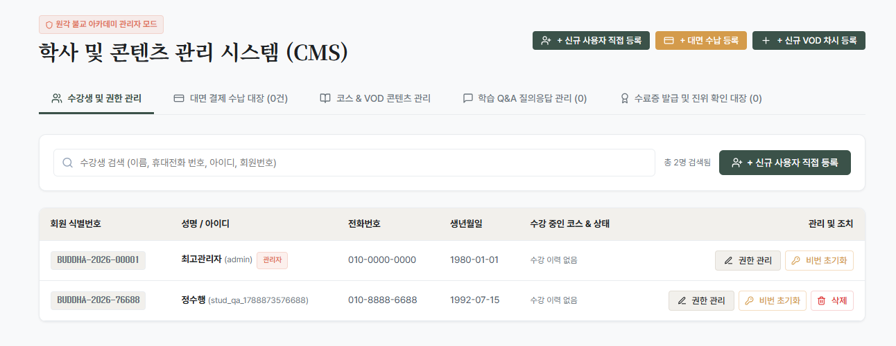

* **학인 명부 검색**: 학번, 성명, 아이디, 전화번호로 실시간 검색
* **권한 상태 요약**: 각 학인별 시스템 권한(`최고관리자` / `일반 수강생`) 및 강좌별 수강 권한 실시간 파악
* **비밀번호 초기화**: 학인이 비밀번호를 분실한 경우 임시 비밀번호를 관리자가 직접 재설정

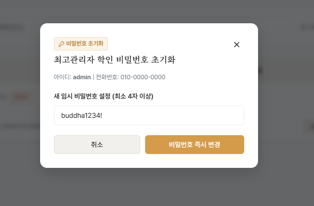

---

### 8.2 신규 학인 직접 등록 및 수납 동시 등재
교학처에 직접 방문하여 원서를 접수하고 수강료를 납부하신 학인을 관리자가 직접 전산에 등록합니다.

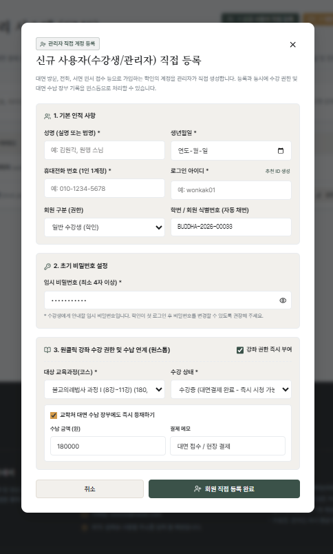

1. 관리자 화면 우측 상단의 **[+ 신규 사용자 직접 등록]**을 클릭합니다.
2. 학인 기본 정보(성명, 아이디, 비밀번호, 생년월일, 연락처)를 입력합니다.
   * **[아이디 자동추천]** 기능으로 중복 없는 고유 아이디 생성 지원
3. **강좌 권한 즉시 배정**: 수강할 강좌 선택 및 상태(`active` 수강중) 설정
4. **대면 수납 장부 즉시 등재**: 결제 금액(180,000원)과 결제 메모를 입력하면 학인 등록과 동시에 수납 장부에 자동 기록됩니다.

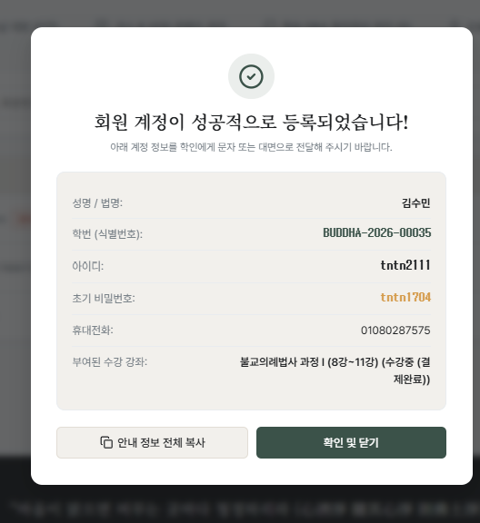

* 등록 성공 시 학인에게 전달할 안내 정보(아이디, 초기 비밀번호, 배정 강좌)가 요약 카드로 표시되며, **[안내 정보 전체 복사]** 버튼으로 문자나 카카오톡으로 손쉽게 전송할 수 있습니다.

---

### 8.3 교학처 대면 수납 내역 장부 탭
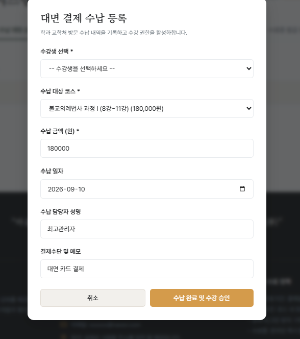

1. **상단 KPI 수납 현황판**:
   * **총 대면 수납 완료액**: 누적 승인된 수강료 총액
   * **수납 대기 인원**: 현재 온라인 신청 후 수납 대기 중인 학인 수 (황색 뱃지 표시)
   * **전체 학인 수**: 현재 등록된 전체 학인 인원
2. **⏳ 대면 수납 대기(납부전) 신청 목록**:
   * 학인이 온라인으로 수강 신청한 내역이 실시간으로 집계됩니다.
   * 학인이 교학처에 방문하여 수납을 완료하면, 우측의 **[💳 대면 수납 확인 및 승인]** 버튼을 1클릭합니다.

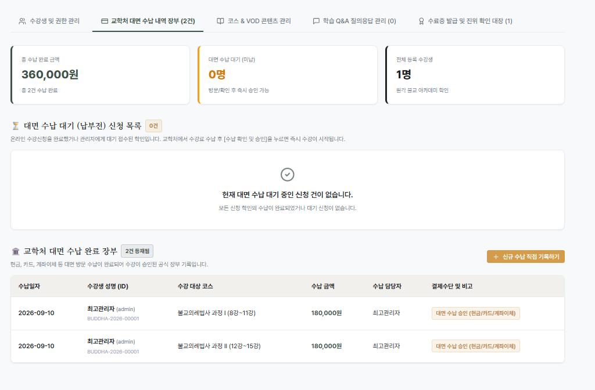

* 승인 즉시 장부에 등재되며, 학인의 '내 강의실' 상태가 **[수강 중]**으로 즉시 전환되어 강의 시청이 시작됩니다.

---

### 8.4 코스 & VOD 콘텐츠 관리 탭
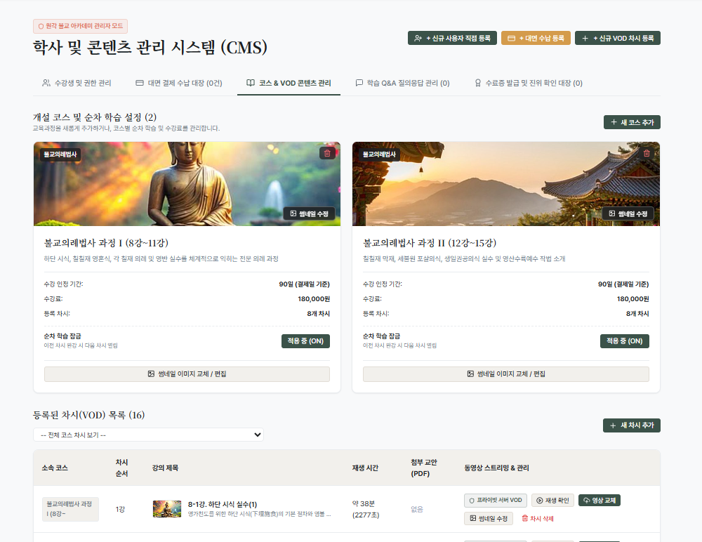

* **순차 학습 잠금 토글**: 코스별 `순차 학습 강제 On/Off` 버튼으로 앞 차시 잠금 규칙을 유연하게 제어
* **신규 교육과정 개설**:
  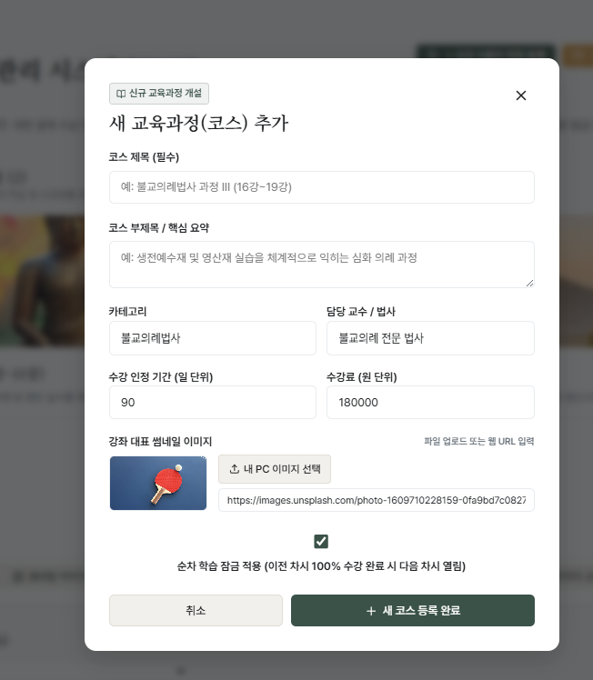
  * 코스 제목, 부제, 카테고리, 수강 기간(기본 90일), 수강료, 대표 썸네일 등록
* **신규 VOD 차시 등록**:
  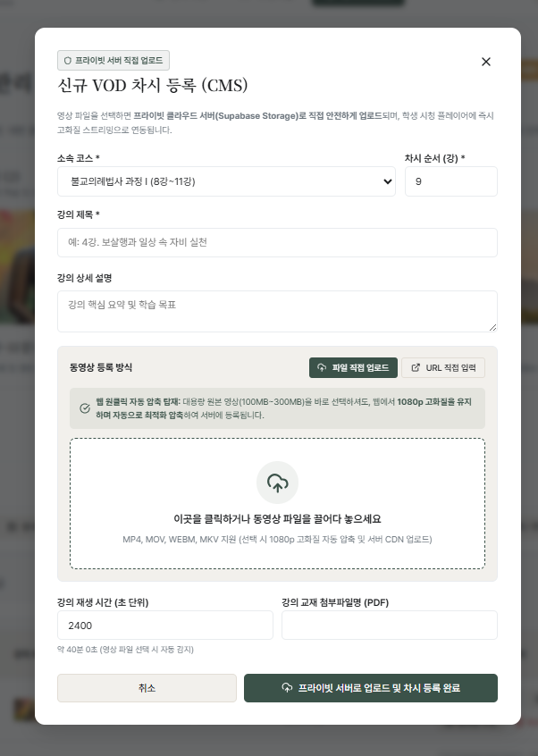
  * 차시 순번, 강의 제목, 설명, 영상 재생시간 입력
  * 동영상 파일 직접 서버 업로드(1080p 고화질 최적화) 또는 스트리밍 URL 연결 지원
  * PDF/HWP 강의 교안 첨부파일 등록

---

### 8.5 공인 수료증 발급 대장 및 진위 검증 탭
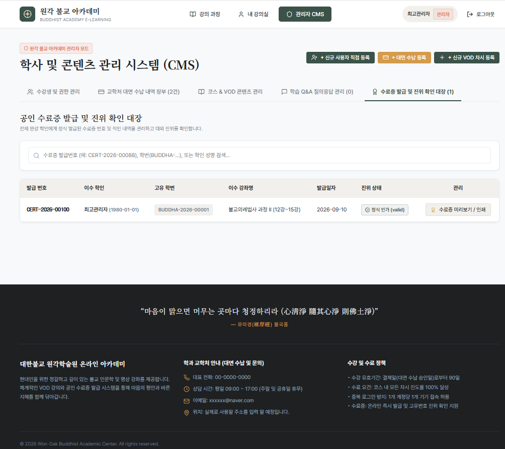

* 발급된 모든 수료증의 일련번호, 학인 성명, 학번, 이수 강좌명, 발급일자 이력 영구 보관
* **[수료증 보기]** 버튼을 클릭하여 학인에게 발급된 정식 수료증 원본을 관리자 화면에서 즉시 열람 및 재인쇄 가능

* **[수료증 보기]** 버튼을 클릭하여 학인에게 발급된 정식 수료증 원본을 관리자 화면에서 즉시 열람 및 재인쇄 가능

