# 🪷 세화붓다아카데미 공식 사용자 및 관리자 통합 매뉴얼

> **공식 서비스 접속 주소**: [https://sehwa-buddha-academy.netlify.app](https://sehwa-buddha-academy.netlify.app)  
> **시스템 명칭**: 사단법인 세화붓다아카데미 (Sehwa Buddha Academy)  
> **교육 목적**: 불교 전통 승가 의례 및 교학 전문 VOD 원격 교육, 엄정한 학사 관리, 자격 검정 온라인 시험 및 정식 공인 자격증/수료증 발급

---

## 📑 목차
1. [플랫폼 개요 및 3대 디바이스 반응형 환경](#1-플랫폼-개요-및-3대-디바이스-반응형-환경)
2. [메인 홈 화면 구성 및 강좌 둘러보기](#2-메인-홈-화면-구성-및-강좌-둘러보기)
3. [회원가입 및 계정 보안 관리](#3-회원가입-및-계정-보안-관리)
4. [로그인 및 비밀번호 재설정](#4-로그인-및-비밀번호-재설정)
5. [강좌 상세 안내 및 수강 신청 (대면 수납 접수)](#5-강좌-상세-안내-및-수강-신청-대면-수납-접수)
6. [나의 강의실 (학습 대시보드)](#6-나의-강의실-학습-대시보드)
7. [스마트 VOD 플레이어 및 순차 학습 시스템](#7-스마트-vod-플레이어-및-순차-학습-시스템)
8. [학습 Q&A (지도 스님 / 교수 질의응답)](#8-학습-qa-지도-스님--교수-질의응답)
9. [자격 검정 온라인 시험 (20문항 실시간 응시 및 채점)](#9-자격-검정-온라인-시험-20문항-실시간-응시-및-채점)
10. [공인 자격증 / 수료증 발급 및 PDF 인쇄](#10-공인-자격증--수료증-발급-및-pdf-인쇄)
11. [자격증 진위 확인 및 정품 인증 포털 (#verify)](#11-자격증-진위-확인-및-정품-인증-포털-verify)
12. [교학처 관리자 통합 시스템 (CMS)](#12-교학처-관리자-통합-시스템-cms)
13. [시스템 전수 모달 알림창(Alert / Confirm) 도감](#13-시스템-전수-모달-알림창alert--confirm-도감)

---

## 1. 플랫폼 개요 및 3대 디바이스 반응형 환경

세화붓다아카데미는 PC 데스크톱, 대형 스마트폰(태블릿), 소형 스마트폰 등 다양한 학습 기기에서 동일한 최상의 경험을 제공하도록 정밀한 반응형 웹 기술이 적용되어 있습니다.

| 구분 | PC 데스크톱 (1440×900 이상) | 대형 스마트폰 (430×932 등) | 소형 스마트폰 (375×667 등) |
| :--- | :--- | :--- | :--- |
| **화면 레이아웃** | 풀 와이드 다단 그리드 배치 | 싱글 컬럼 유연 카드 레이아웃 | 모바일 맞춤형 압축 레이아웃 |
| **네비게이션** | 상단 전체 GNB 메뉴 노출 | 모바일 최적화 헤더 및 터치 액션 | 콤팩트 헤더 및 아이콘 위주 구성 |
| **비디오 플레이어**| 16:9 대화면 시네마틱 모드 | 모바일 전체화면 및 회전 대응 | 반응형 축소 및 볼륨/진도 컨트롤 |
| **모달 팝업창** | 중앙 집중 카드 및 단축키(Esc/Enter)| 화면 너비 맞춤형 플로팅 모달 | 풀 스크린 세이프존 여백 모달 |

---

## 2. 메인 홈 화면 구성 및 강좌 둘러보기

### 2.1 상단 헤더 및 히어로 섹션
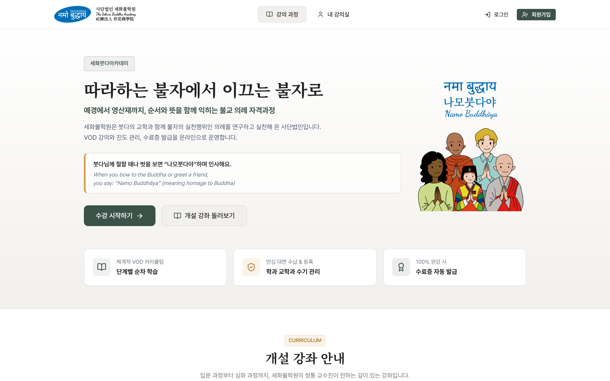

* **상단 GNB**: 세화붓다아카데미 로고, `강의 과정`, `자격증 진위 확인`, `내 강의실`, `로그인 / 회원가입`
* **표제**: *"따라하는 불자에서 이끄는 불자로 — 예경에서 영산재까지, 순서와 뜻을 함께 익히는 불교 의례 자격과정"*
* **인사말**: *"붓다님께 절할 때나 벗을 보면 '나모붓다야'하며 인사해요. When you bow to the Buddha or greet a friend, you say: 'Namo Buddhāya'"*
* **주요 액션 버튼**: `[수강 시작하기 ▶]`를 누르면 대표 강좌 상세 페이지로 즉시 이동하며, `[개설 강좌 둘러보기]`를 누르면 하단 강좌 섹션으로 부드럽게 스크롤됩니다.

### 2.2 디바이스별 홈 화면 비교
| 대형 스마트폰 (iPhone 14 Pro Max) | 소형 스마트폰 (iPhone SE) |
| :---: | :---: |
| 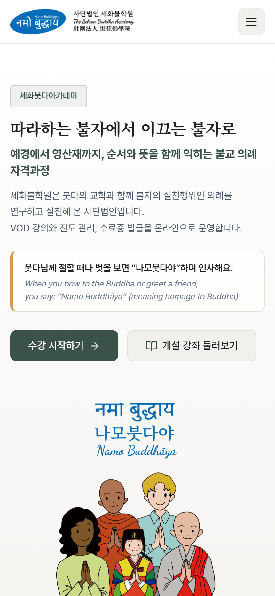 | 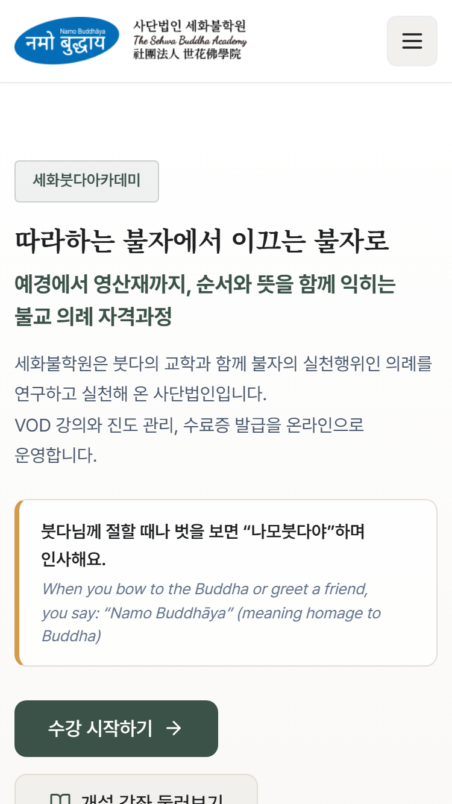 |

### 2.3 개설 강좌 안내 (수강료 50,000원 안내)
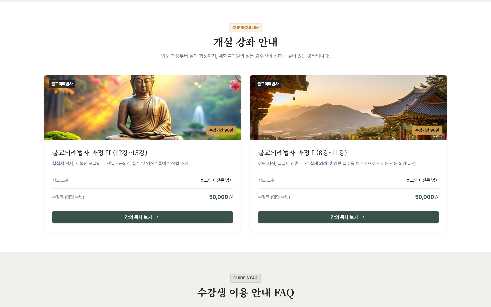
* 개설된 정규 과정인 **불교의례법사 과정 I (8강~11강)** 및 **불교의례법사 과정 II (12강~15강)**의 상세 정보를 확인할 수 있습니다.
* 각 강좌는 **과목당 수강료 50,000원(대면 수납 원칙)**이며, 수강 인정 기간은 **90일**입니다.

---

## 3. 회원가입 및 계정 보안 관리

### 3.1 신규 회원가입 절차
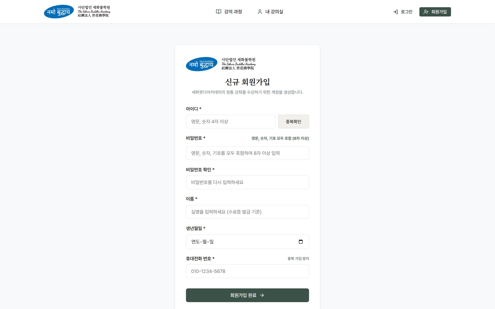

1. 우측 상단의 `[회원가입]` 버튼을 클릭합니다.
2. 필수 입력 항목을 작성합니다:
   * **아이디**: 영문 소문자 및 숫자로 조합된 고유 계정명 (실시간 중복 검증)
   * **비밀번호**: **영문, 숫자, 특수문자 중 2가지 이상을 조합하여 8자 이상** 입력 (보안 검증 통과 필수)
   * **성명**: 실명 또는 법명(스님/불자) 입력 (향후 정식 자격증에 인쇄됨)
   * **생년월일**: 8자리 생년월일 선택
   * **휴대전화 번호**: 본인 확인 및 학사 안내용 연락처 (중복 가입 방지)
3. `[회원가입 완료]` 버튼을 누르면 즉시 고유 **학번(`BUDDHA-2026-XXXXX`)**이 자동 부여되며 가입이 완료됩니다.

---

## 4. 로그인 및 비밀번호 재설정

### 4.1 로그인
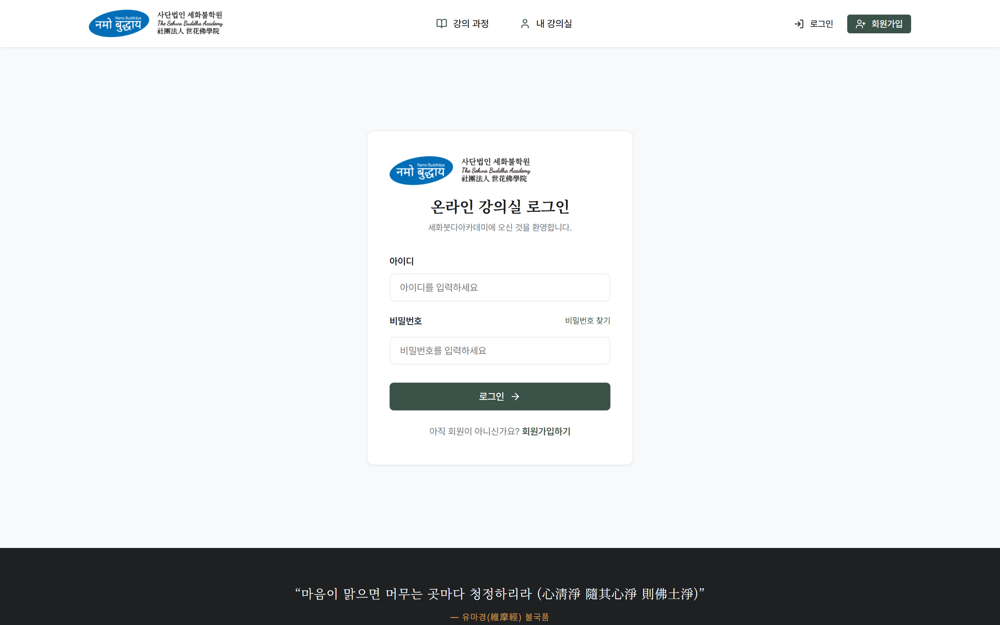
* 발급받으신 아이디와 비밀번호를 입력하고 `[로그인 →]`을 누릅니다.
* 최고관리자 계정(`admin` / `admin1234`)으로 로그인 시 상단에 `[관리자 CMS]` 메뉴가 활성화됩니다.

### 4.2 비밀번호 찾기 (본인 확인 후 재설정)
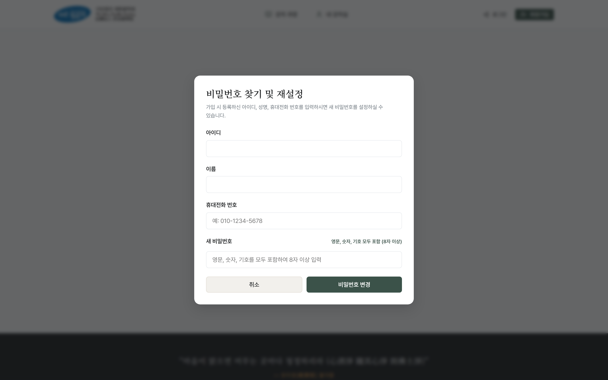
* 로그인 화면 하단의 `[비밀번호 찾기]`를 클릭하면 안전한 본인 인증 모달이 열립니다.
* 가입 시 등록했던 **아이디, 성명, 휴대전화 번호**를 입력하여 일치하면 즉시 새 비밀번호를 설정할 수 있습니다.

---

## 5. 강좌 상세 안내 및 수강 신청 (대면 수납 접수)

### 5.1 강좌 상세 페이지
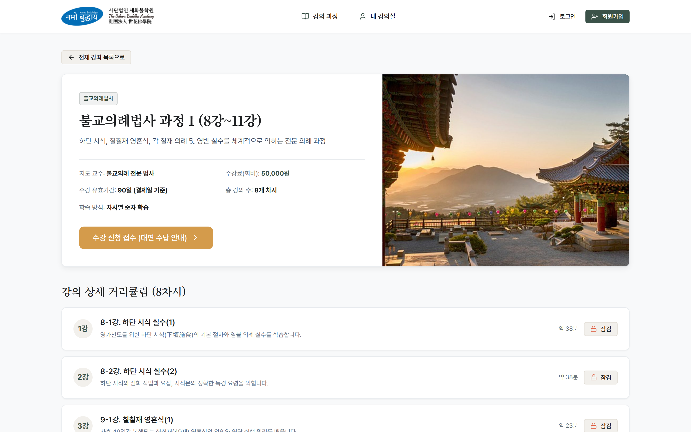
* 강좌의 커리큘럼, 교수진 정보, 차시 목록(1강~4강), 과목당 수강료(50,000원)를 한눈에 파악할 수 있습니다.
* 미수강자가 차시를 클릭하면 **[수강 권한 안내]** 모달 알림창이 팝업됩니다.

### 5.2 수강 신청 버튼 클릭 시
* `[수강 신청하기 (50,000원 대면 수납)]` 버튼을 클릭하면 세화붓다아카데미 전용 **[수강 신청 접수 완료]** 모달이 나타납니다.
* 신청 즉시 학적 상태는 **[대기상태 (대면 수납 대기)]**로 등록되며, 교학처(02-2260-8888) 방문 수납 완료 시 관리자 승인을 통해 즉시 [수강 중]으로 전환됩니다.

---

## 6. 나의 강의실 (학습 대시보드)

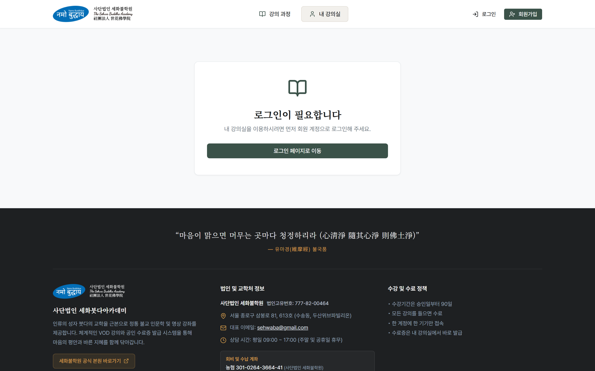

학인의 수강 이력과 자격증 취득 과정을 총괄 관리하는 개인 배움터입니다:
1. **수강 중인 강좌**:
   * 차시별 시청 진도율 프로그레스 바 실시간 표시
   * 잔여 수강 기간 D-Day 안내
   * `[강의실 입장 (학습 이어하기) ▶]` 버튼을 통해 마지막 시청 지점부터 바로 수강 가능
2. **대면 수납 대기 강좌**:
   * 대면 수납 접수증 및 교학처 방문 수납 안내 표시
3. **완강 및 자격 시험 응시 가능 강좌**:
   * 모든 강의를 완강하면 `[📝 자격 검정 시험 응시하기]` 버튼이 황금빛으로 활성화됩니다.
4. **수료 완료 강좌**:
   * 시험 60점 이상 득점 시 공인 자격증 `[📜 수료증 / 자격증 보기]` 버튼이 제공됩니다.

---

## 7. 스마트 VOD 플레이어 및 순차 학습 시스템

### 7.1 비디오 플레이어 인터페이스
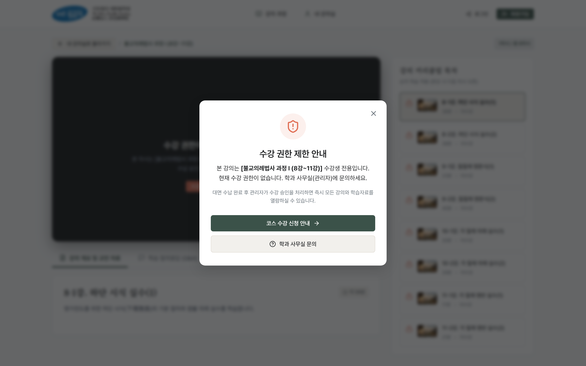

* **1080p Full HD 스트리밍**: 끊김 없는 고화질 영상 재생
* **이어보기 기능**: 학습자가 시청한 마지막 초(Seconds) 단위 위치가 자동 저장되어 언제 어디서든 이어서 학습 가능
* **교안 다운로드**: 각 차시별 강의 교안 PDF 파일을 클릭 한 번으로 다운로드
* **단계별 순차 학습 시스템 (중요)**:
  * 앞 차시를 100% 완강해야만 다음 차시가 자동으로 잠금 해제됩니다.
  * 미완강 상태에서 다음 차시를 클릭하면 **[순차 학습 잠금 안내]** 모달 알림창이 나타납니다.

---

## 8. 학습 Q&A (지도 스님 / 교수 질의응답)

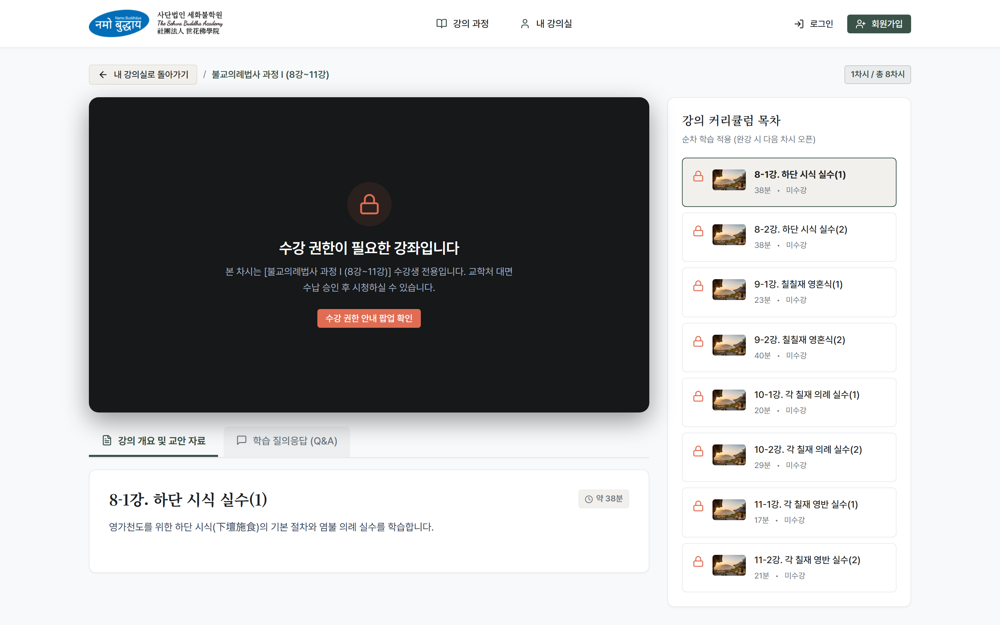

* **영상 타임스탬프 자동 연동**: 질문 작성 시 현재 시청 중인 비디오의 시간(예: `12:35`)이 질문에 자동 태깅되어, 답변자 및 학우가 해당 타임스탬프를 클릭하면 영상의 그 장면으로 즉시 이동합니다.
* **스님 공식 답변 배지**: 담당 지도교수 및 학술원 원장 스님이 직접 작성한 법문 답변이 정중한 금빛 배지와 함께 등록됩니다.

---

## 9. 자격 검정 온라인 시험 (20문항 실시간 응시 및 채점)

### 9.1 시험 안내 및 응시 자격
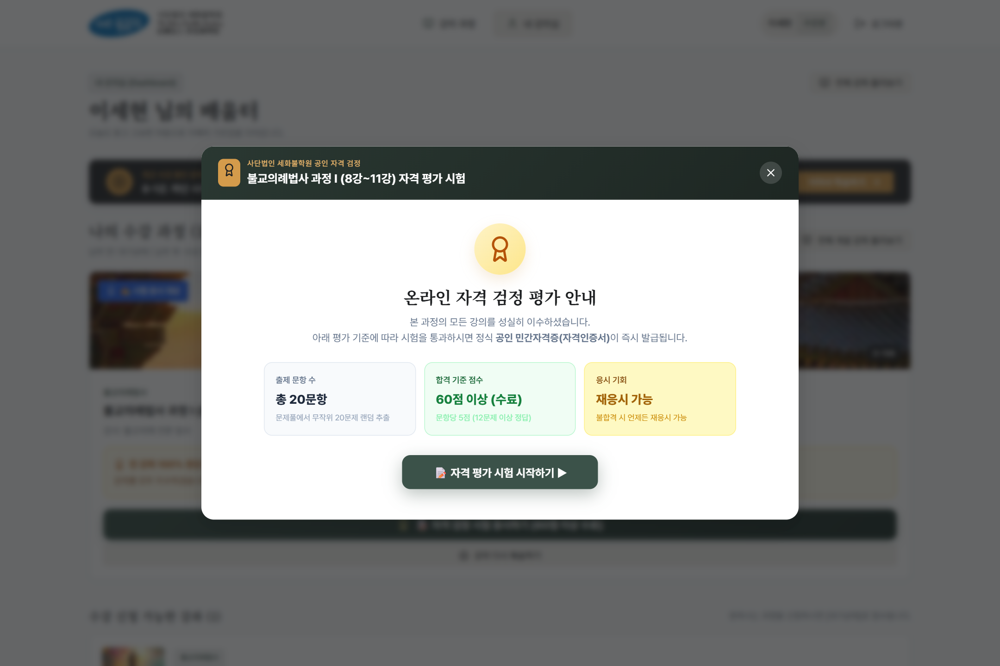
* 모든 차시를 100% 완강한 학인에 한하여 응시 기회가 주어집니다.
* 코스별 문제 은행에서 **20문항이 무작위(Random)로 추출**되어 출제됩니다.
* **합격 기준**: 100점 만점 중 **60점 이상(12문항 이상 정답)**

### 9.2 실시간 시험 응시 화면
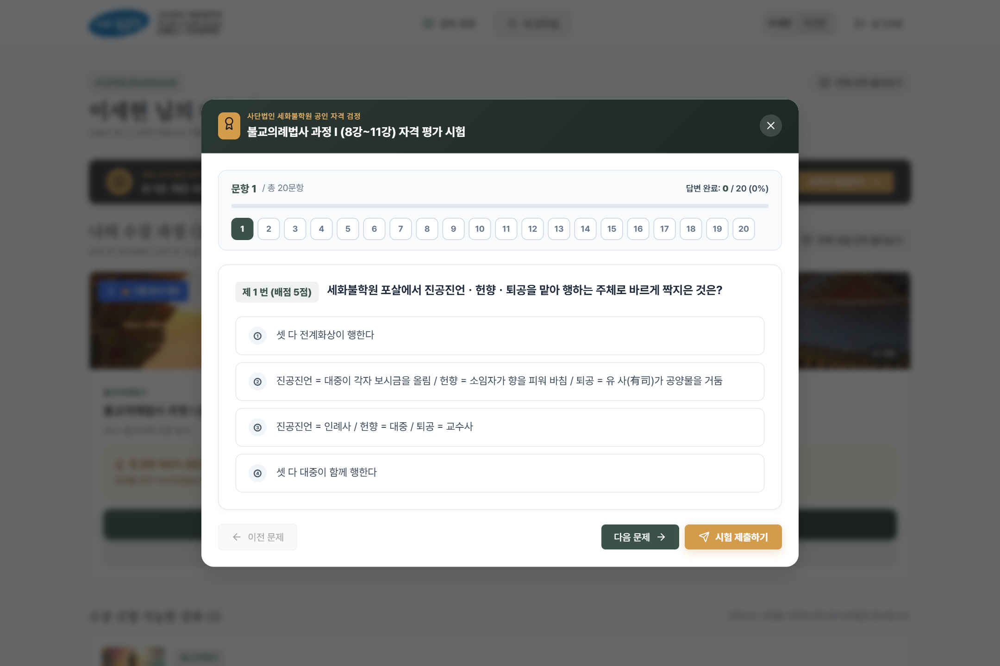
* 타이머와 문항 탐색기가 제공되며, 각 보기 선택 후 `[답안 최종 제출하기]`를 누르면 컨펌 창 확인 후 즉시 자동 채점됩니다.

### 9.3 채점 결과 및 합격 축하
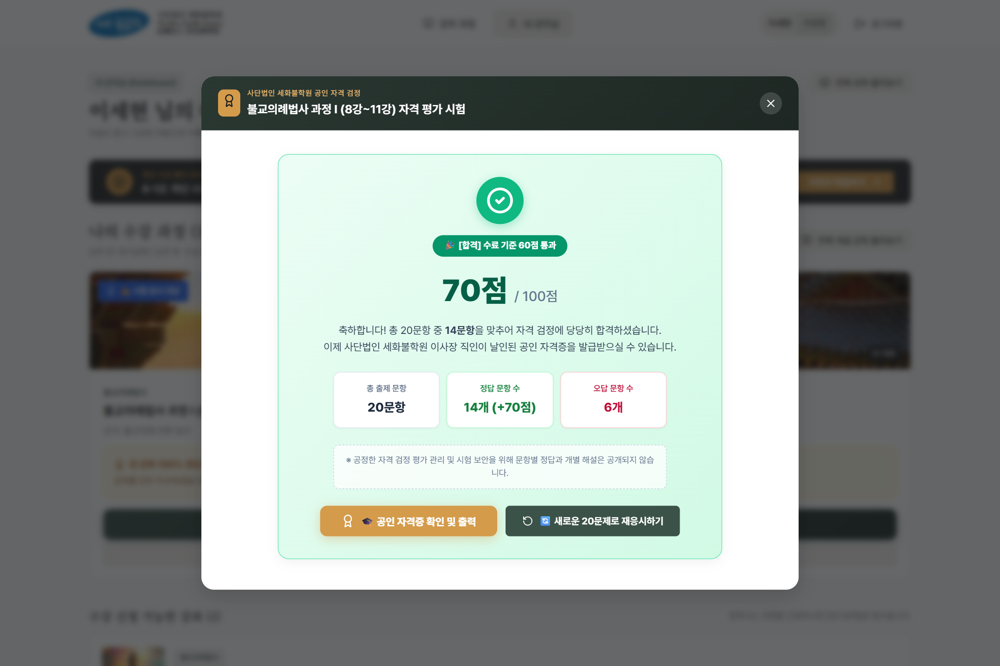
* 채점 점수가 즉시 공개되며, 60점 이상 취득 시 합격 축하와 함께 `[공인 자격증 발급받기]` 버튼이 활성화됩니다.

---

## 10. 공인 자격증 / 수료증 발급 및 PDF 인쇄

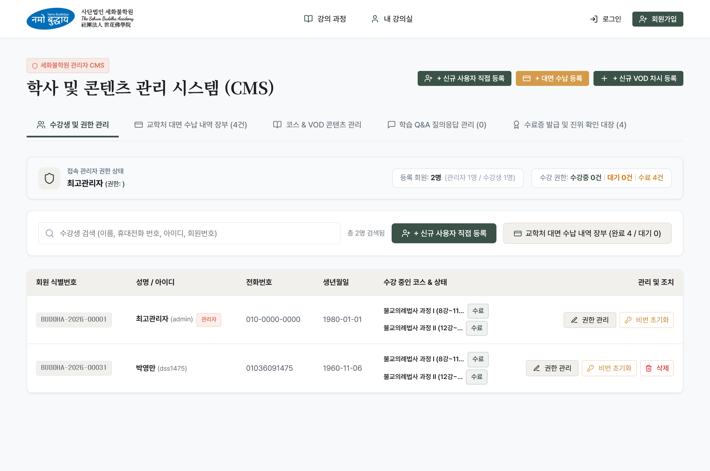

* **정식 공인 규격**: A4 세로 비율에 맞추어 금빛 봉황 전통 문양 테두리와 붓다아카데미 정식 직인이 날인됩니다.
* **기재 사항**: 자격증 종목(불교의례법사), 공인 등록번호, 성명, 생년월일, 학번, 교육 기간
* **보안 기능**: 고유 위조방지 시리얼 번호 및 실시간 진위 검증 QR코드가 탑재되어 있습니다.
* **인쇄 기능**: 하단의 `[A4 규격 인쇄 / PDF 저장]` 버튼을 누르면 브라우저 인쇄 창이 열려 깨끗한 고해상도 PDF로 저장하거나 종이로 출력할 수 있습니다.

---

## 11. 자격증 진위 확인 및 정품 인증 포털 (#verify)

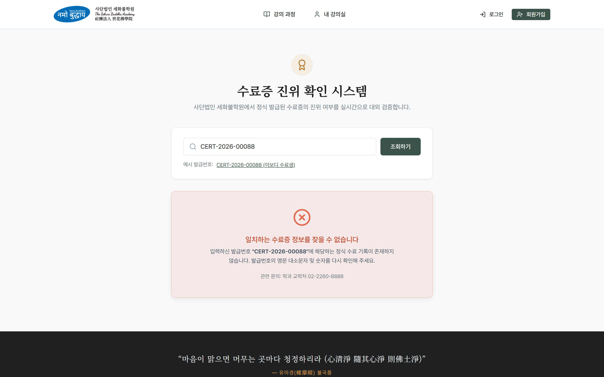

* 대외 기관, 사찰, 교육생 누구나 자격증 번호(예: `제 2026-법사2급-0001 호`) 또는 시리얼 번호를 입력하여 즉시 정품 인증 여부를 조회할 수 있습니다.
* 유효한 자격증인 경우 성명(개인정보 보호 마스킹), 자격 종목, 인가 기관(문화체육관광부 민간자격 등록번호)이 공인 검증되어 표시됩니다.

---

## 12. 교학처 관리자 통합 시스템 (CMS)

최고관리자(`admin`)로 로그인 시 접속할 수 있는 학사 및 콘텐츠 총괄 관리자 패널입니다:

### 12.1 수강생 관리
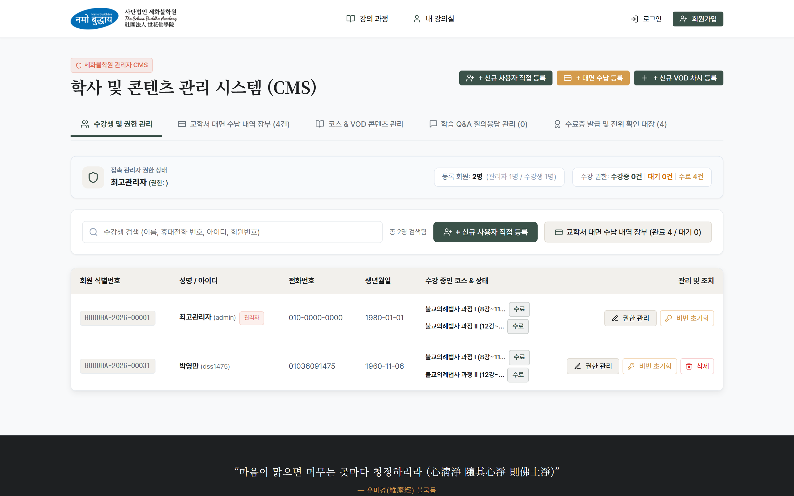
* 등록된 전체 학인의 학번, 연락처, 가입일, 수강 현황을 검색 및 조회합니다.
* 특정 학인에게 강좌 수강 권한을 수동 부여하거나, 비밀번호를 분실한 학인의 비밀번호를 원클릭으로 초기화할 수 있습니다.

### 12.2 대면 수납 승인 장부

* 교학처 방문 대면 수납을 대기 중인 학인 목록(`pending`)을 확인하고, `[대면 수납 승인]` 버튼 클릭 한 번으로 수납 장부에 등재하며 학인의 수강 권한을 즉시 활성화합니다.

### 12.3 CMS 강좌 및 차시 관리
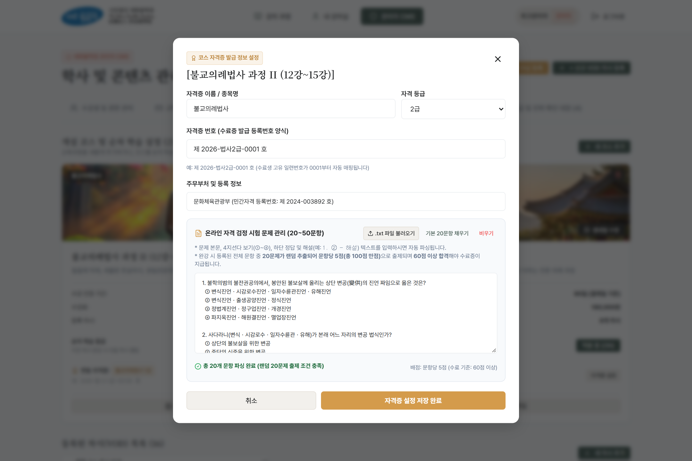
* **신규 코스 개설**: 코스명, 수강료(50,000원), 자격증 종목 및 시험 문항을 텍스트로 일괄 등록 및 자동 파싱
* **차시 등록 및 비디오 최적화**: 1080p 고화질 동영상 파일을 선택하면 브라우저에서 자동 최적화 압축 후 클라우드 스토리지로 직접 업로드
* **순차 학습 On/Off**: 코스별 순차 학습 잠금 원칙을 자유롭게 켜고 끌 수 있습니다.

### 12.4 질의응답 (Q&A) 통합 관리
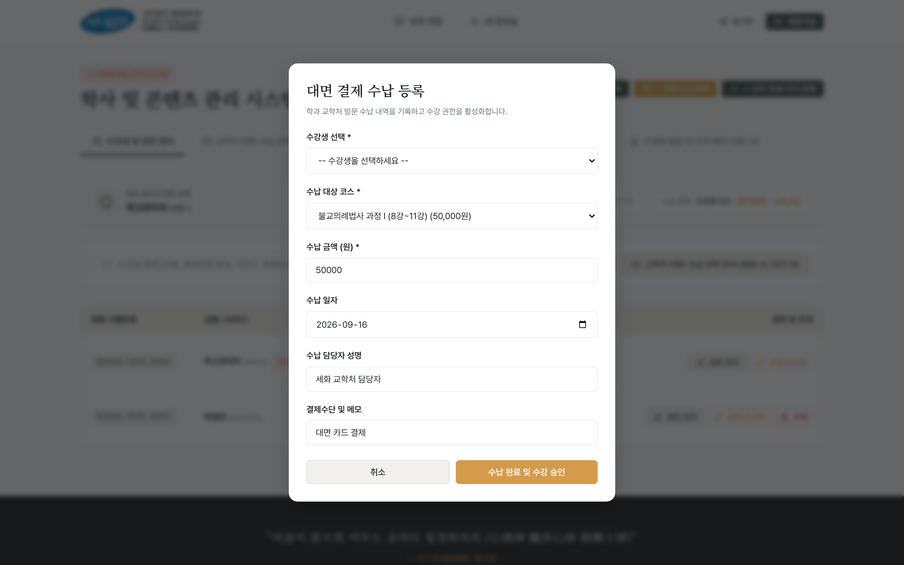
* 전체 강좌에 등록된 모든 학인의 질문을 모아보고, 스님 명의(`지산 스님 / 불교학술원 원장`)로 공식 법문 답변을 작성하여 등록합니다.

---

## 13. 시스템 전수 모달 알림창(Alert / Confirm) 도감

기존 브라우저의 투박한 회색 `alert()` 창을 전면 제거하고 세화붓다아카데미 전용 디자인 토큰으로 맞춤 제작된 커스텀 모달 알림창 도감입니다:

| 구분 | 모달 명칭 및 역할 | 화면 미리보기 |
| :---: | :--- | :---: |
| **01** | **수강 신청 접수 완료 (성공)** 대면 수납 대기 상태 등록 안내 |  |
| **02** | **순차 학습 잠금 안내 (경고)** 이전 차시 미완강 시 다음 차시 수강 제한 | 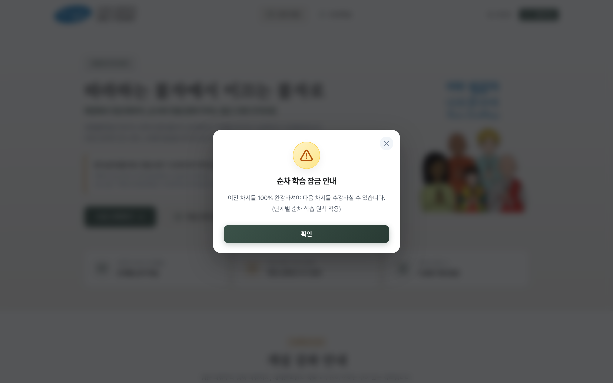 |
| **03** | **교안 다운로드 안내 (정보)** 차시별 실무 교안 PDF 다운로드 안내 | 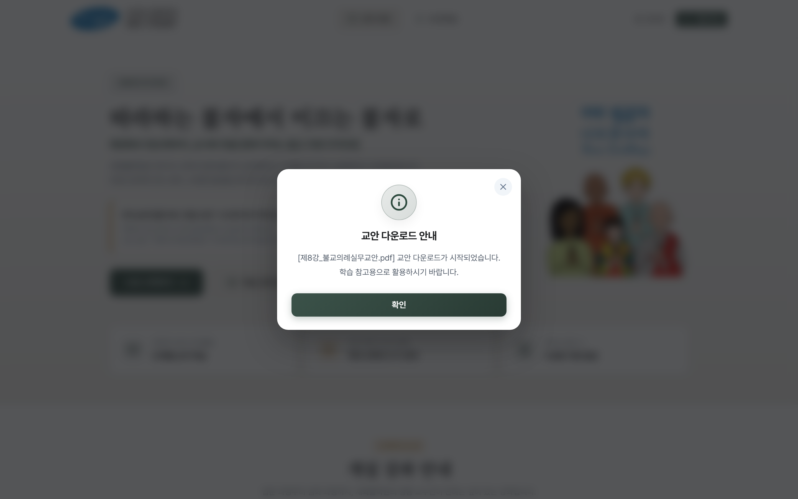 |
| **04** | **로그인 및 인증 오류 (오류)** 비밀번호 불일치 및 접근 권한 제한 안내 | 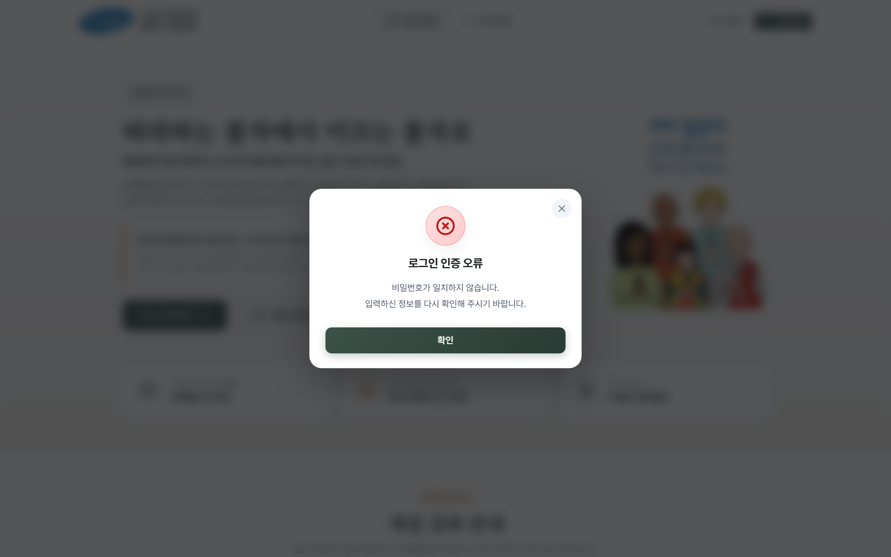 |
| **05** | **대면 수납 승인 확인 (컨펌)** 교학처 관리자 수납 승인 및 장부 등재 컨펌 | 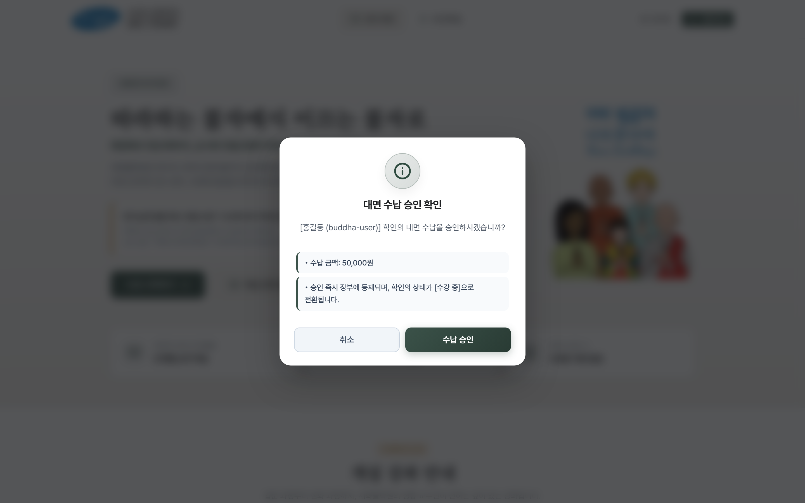 |
| **06** | **차시 영구 삭제 확인 (컨펌)** 강의 차시 및 스트리밍 연결 삭제 컨펌 | 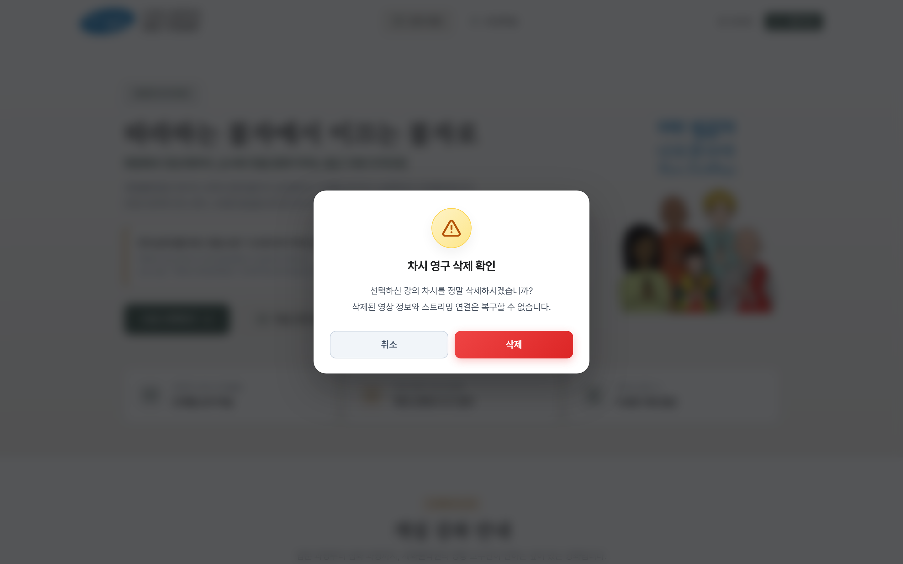 |
| **07** | **관리자 비밀번호 초기화 (성공)** 학인 계정 임시 비밀번호 재발급 안내 | 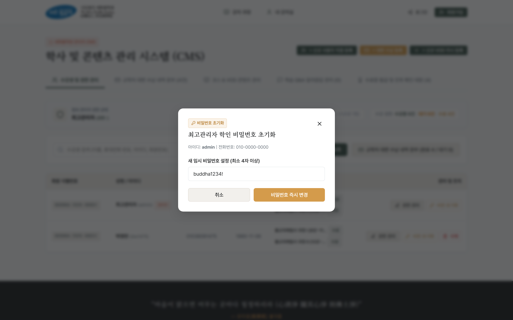 |
| **08** | **자격증 및 시험 문항 설정 (성공)** 20문항 무작위 시험 및 자격증 양식 저장 |  |

---
*문서 작성일: 2026년 9월 16일 | 사단법인 세화붓다아카데미 교학처 교육정보원*
