# 🪷 세화붓다아카데미 공식 사용자 및 관리자 통합 매뉴얼

> **공식 서비스 접속 주소**: [https://sehwa-buddha-academy.netlify.app](https://sehwa-buddha-academy.netlify.app)  
> **시스템 명칭**: [사]세화붓다아카데미 (Sehwa Buddha Academy)  
> **교육 목적**: 불교 전통 승가 의례 및 교학 전문 VOD 원격 교육, 엄정한 학사 관리, 자격 검정 온라인 시험 및 정식 공인 자격증/수료증 발급

---

## 📑 목차
1. [플랫폼 개요 및 3대 디바이스 반응형 환경](#1-플랫폼-개요-및-3대-디바이스-반응형-환경)
2. [메인 홈 화면 구성 및 강좌 둘러보기](#2-메인-홈-화면-구성-및-강좌-둘러보기)
3. [회원가입 및 계정 보안 관리](#3-회원가입-및-계정-보안-관리)
4. [로그인 및 비밀번호 재설정](#4-로그인-및-비밀번호-재설정)
5. [강좌 상세 안내 및 수강 신청 (계좌 입금 · 대면 수납)](#5-강좌-상세-안내-및-수강-신청-계좌-입금--대면-수납)
6. [나의 강의실 (학습 대시보드)](#6-나의-강의실-학습-대시보드)
7. [스마트 VOD 플레이어 및 순차 학습 시스템](#7-스마트-vod-플레이어-및-순차-학습-시스템)
8. [학습 Q&A (지도 스님 / 교수 질의응답)](#8-학습-qa-지도-스님--교수-질의응답)
9. [자격 검정 온라인 시험 (20문항 실시간 응시 및 채점)](#9-자격-검정-온라인-시험-20문항-실시간-응시-및-채점)
10. [공인 자격증 / 수료증 발급 및 PDF 인쇄](#10-공인-자격증--수료증-발급-및-pdf-인쇄)
11. [자격증 진위 확인 및 정품 인증 포털 (#verify)](#11-자격증-진위-확인-및-정품-인증-포털-verify)
12. [교학처 관리자 통합 시스템 (CMS)](#12-교학처-관리자-통합-시스템-cms)
13. [시스템 전수 모달 알림창(Alert / Confirm) 도감](#13-시스템-전수-모달-알림창alert--confirm-도감)

---

## 1. 플랫폼 개요 및 3대 디바이스 반응형 환경

세화붓다아카데미는 PC 데스크톱, 대형 스마트폰(태블릿), 소형 스마트폰 등 다양한 학습 기기에서 동일한 최상의 경험을 제공하도록 정밀한 반응형 웹 기술이 적용되어 있습니다.

| 구분 | PC 데스크톱 (1440×900 이상) | 대형 스마트폰 (430×932 등) | 소형 스마트폰 (375×667 등) |
| :--- | :--- | :--- | :--- |
| **화면 레이아웃** | 풀 와이드 다단 그리드 배치 | 싱글 컬럼 유연 카드 레이아웃 | 모바일 맞춤형 압축 레이아웃 |
| **네비게이션** | 상단 전체 GNB 메뉴 노출 | 모바일 최적화 헤더 및 터치 액션 | 콤팩트 헤더 및 아이콘 위주 구성 |
| **비디오 플레이어**| 16:9 대화면 시네마틱 모드 | 모바일 전체화면 및 회전 대응 | 반응형 축소 및 볼륨/진도 컨트롤 |
| **모달 팝업창** | 중앙 집중 카드 및 단축키(Esc/Enter)| 화면 너비 맞춤형 플로팅 모달 | 풀 스크린 세이프존 여백 모달 |

---

## 2. 메인 홈 화면 구성 및 강좌 둘러보기

### 2.1 상단 헤더 및 히어로 섹션
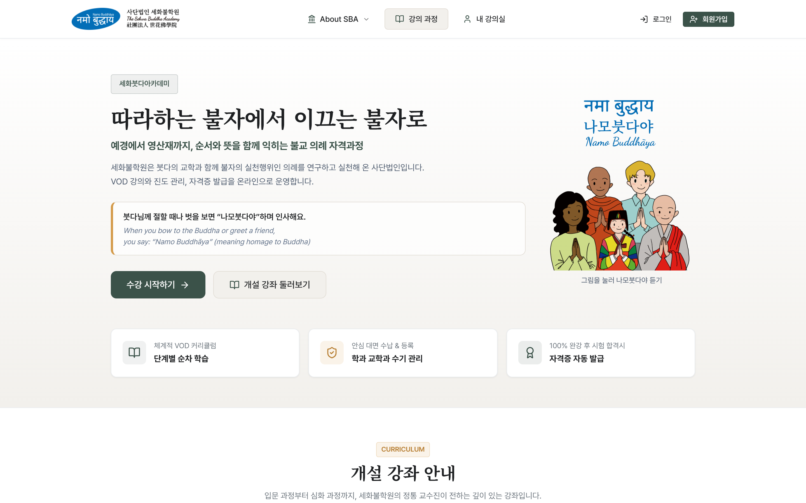

* **상단 GNB**: 세화붓다아카데미 로고, `About SBA`, `강의 과정`, `내 강의실`, `로그인 / 회원가입`
* **표제**: *"따라하는 불자에서 이끄는 불자로 — 예경에서 영산재까지, 순서와 뜻을 함께 익히는 불교 의례 자격과정"*
* **인사말**: *"붓다님께 절할 때나 벗을 보면 '나모붓다야'하며 인사해요. When you bow to the Buddha or greet a friend, you say: 'Namo Buddhāya'"* (오른쪽 그림을 누르면 나모붓다야 노래를 들을 수 있습니다.)
* **주요 액션 버튼**: `[수강 시작하기 →]`를 누르면 대표 강좌 상세 페이지로 즉시 이동하며, `[개설 강좌 둘러보기]`를 누르면 하단 강좌 섹션으로 부드럽게 스크롤됩니다.
* **공지 팝업**: 관리자가 게시한 공지가 있으면 홈 화면 접속 시 팝업으로 표시됩니다.
* **About SBA 메뉴**: 상단 `About SBA`를 누르면 `설립목적`, `신행헌장`, `학회연혁`, `학회정관`, `조직활동`, `About SBA` 소개 페이지와 `Band 바로가기`(세화불학원 공식 네이버 밴드)로 이동할 수 있습니다.
* **하단 푸터**: 법인 및 교학처 정보(주소·대표 이메일), 세화불학원 공식 본원·네이버 밴드 바로가기, 수강 및 수료 정책(수강기간 90일, 한 계정에 한 기기만 접속, 실물 자격증 발급비 10,000원 등)이 표시됩니다. 정책 아래 `[온라인 강좌 서비스 이용약관]`을 누르면 이용약관 PDF(환불규정 포함)가 새 탭에서 열립니다.

| 홈 화면 공지 팝업 | About SBA 학회 소개 |
| :---: | :---: |
| 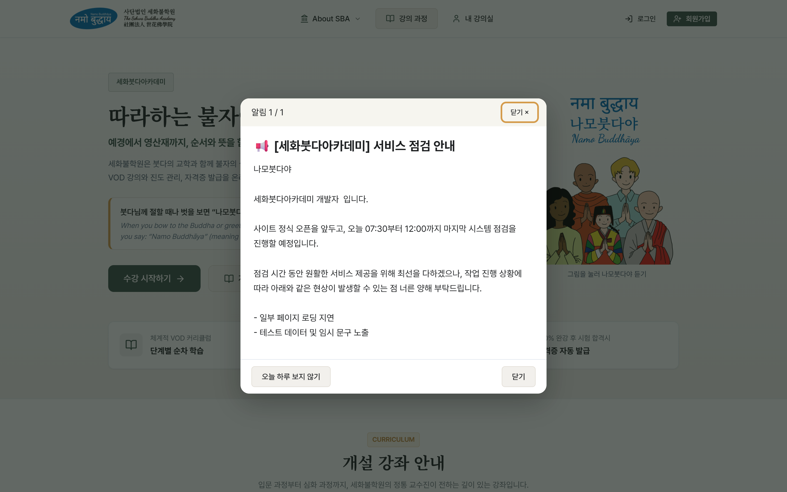 | 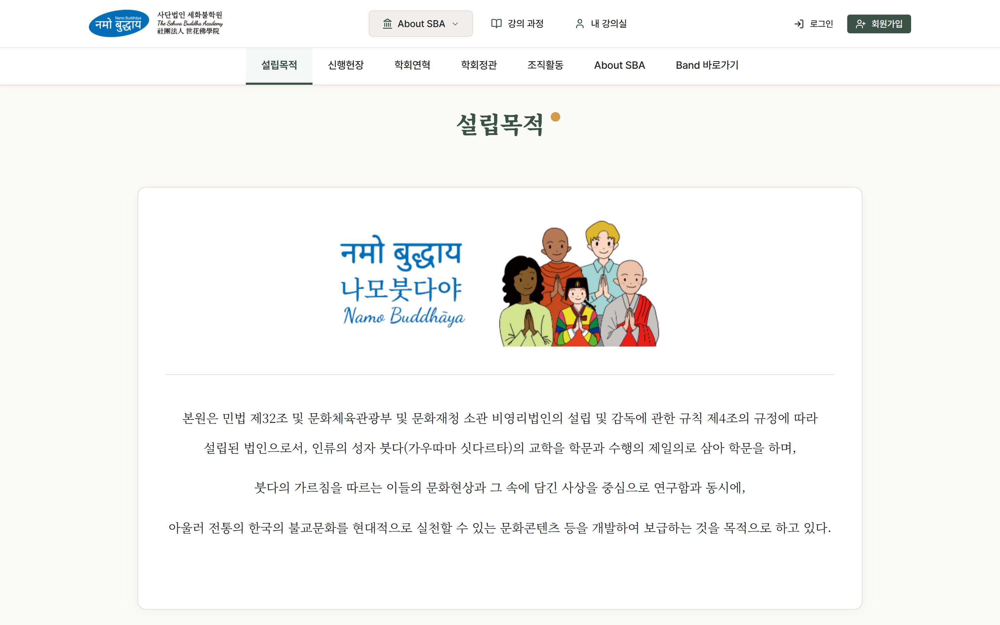 |

### 2.2 디바이스별 홈 화면 비교
| 대형 스마트폰 (iPhone 14 Pro Max) | 소형 스마트폰 (iPhone SE) |
| :---: | :---: |
| 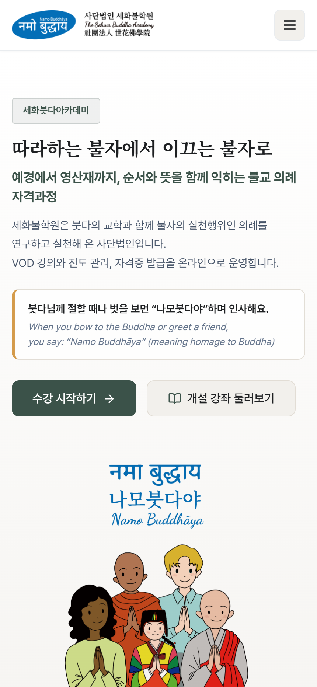 | 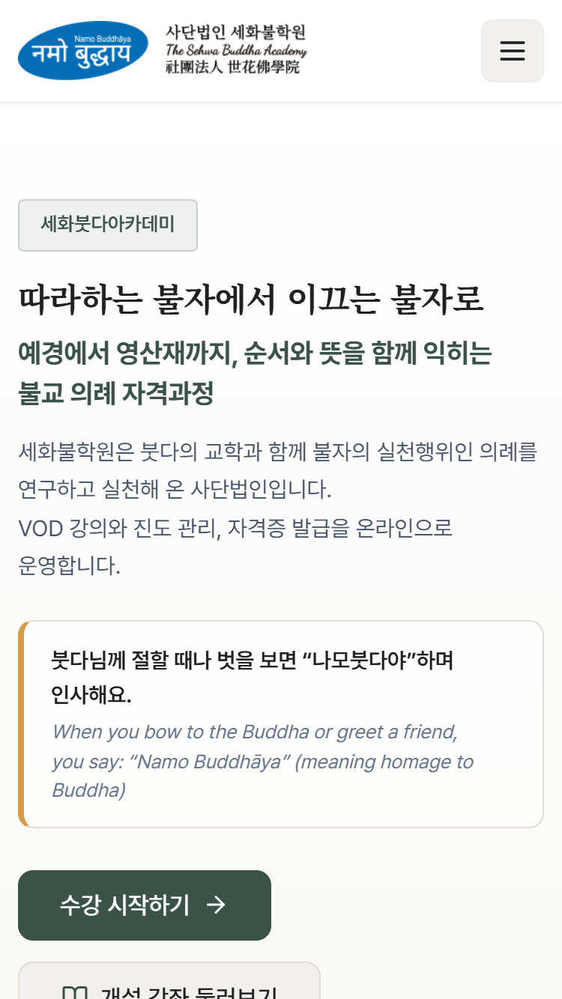 |

### 2.3 개설 강좌 안내 (수강료 50,000원 안내)
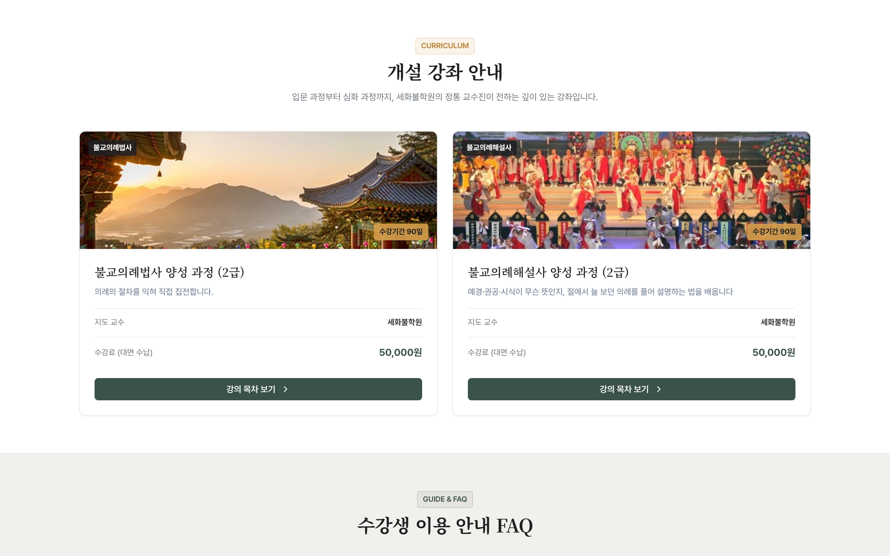
* 개설된 정규 과정인 **불교의례법사 양성 과정 (2급)** 및 **불교의례해설사 양성 과정 (2급)**의 상세 정보를 확인할 수 있습니다. (각 30차시)
* 각 강좌는 **과목당 수강료 50,000원**이며, 수강 인정 기간은 **수강 승인일로부터 90일**입니다.

---

## 3. 회원가입 및 계정 보안 관리

### 3.1 신규 회원가입 절차
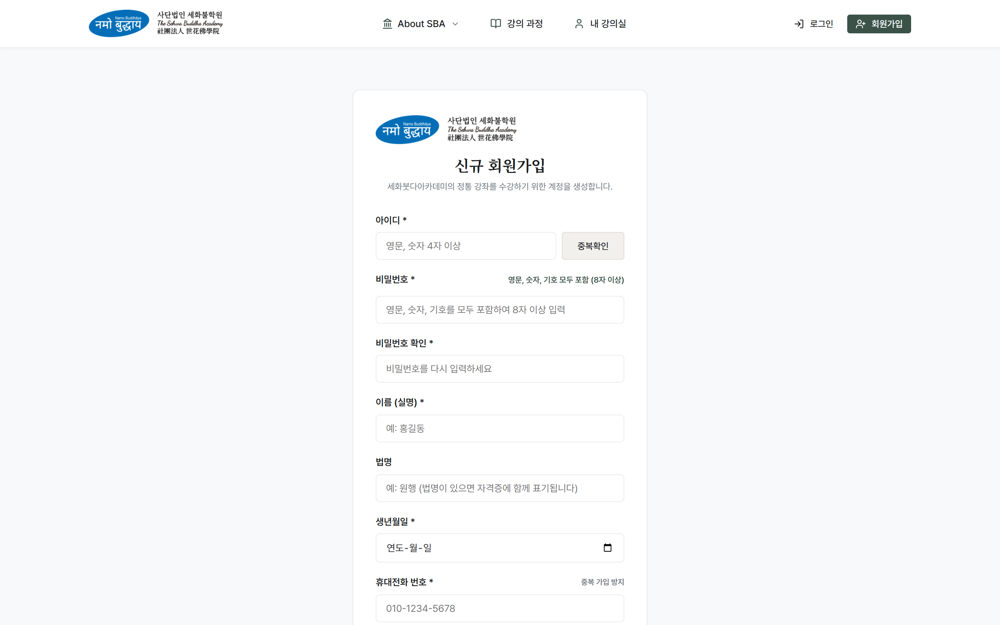

1. 우측 상단의 `[회원가입]` 버튼을 클릭합니다.
2. 필수 입력 항목을 작성합니다:
   * **아이디**: 영문, 숫자 4자 이상의 고유 계정명 (`[중복확인]` 필수)
   * **비밀번호**: **영문, 숫자, 기호를 모두 포함하여 8자 이상** 입력
   * **이름 (실명)**: 자격증에 그대로 인쇄되므로 실명을 정확히 입력
   * **법명 (선택)**: 법명이 있으면 입력하며, 자격증 성명 옆에 괄호로 함께 표기됩니다. (예: 홍길동 (원행))
   * **생년월일**: 날짜 선택
   * **휴대전화 번호**: 본인 확인 및 학사 안내 문자 수신용 연락처 (중복 가입 방지)
   * **개인정보 수집·이용 동의 (필수)**: 연락처는 수강 신청·질의응답 안내 문자 발송에 사용됩니다.
3. `[회원가입 완료]` 버튼을 누르면 가입 순서대로 고유 **학번**(예: `BUDDHA-2026-00001`, 연도별 순번)이 자동 부여되며 가입이 완료됩니다. (자격증의 학적식별번호로 사용)

---

## 4. 로그인 및 비밀번호 재설정

### 4.1 로그인
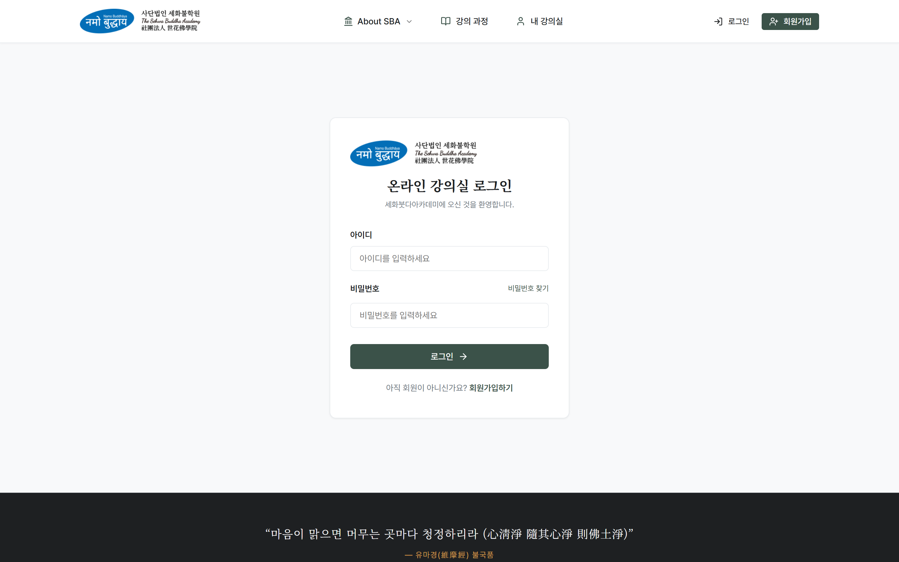
* 등록한 아이디와 비밀번호를 입력하고 `[로그인 →]`을 누릅니다.
* 관리자 계정으로 로그인하면 상단에 `[관리자 CMS]` 메뉴가 활성화됩니다.
* **1인 1기기 접속**: 다른 기기나 브라우저에서 같은 아이디로 새로 로그인하면 기존 접속이 자동 종료되고 **[중복 로그인 감지]** 안내가 표시됩니다. 본인이 로그인하지 않았다면 즉시 비밀번호를 변경해야 합니다.

### 4.2 비밀번호 찾기 (교학처 문의 후 관리자 초기화)
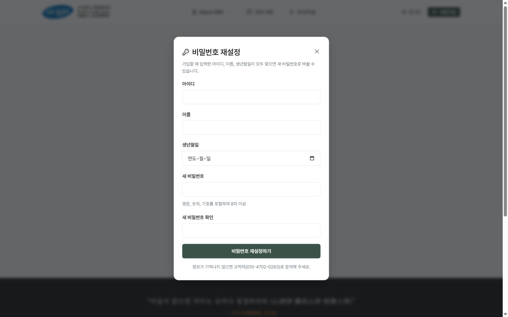
* 로그인 화면의 `[비밀번호 찾기]`를 누르면 비밀번호 재설정 안내가 표시됩니다.
* 교학처(010-4702-0283)에 문의하여 본인 확인을 마치면 관리자가 비밀번호를 초기화해 드립니다.

### 4.3 비밀번호 변경 (로그인 후 본인이 직접)
* `내 강의실` 상단의 `[비밀번호 변경]`을 누르고 **현재 비밀번호**, **새 비밀번호**, **새 비밀번호 확인**을 입력합니다.
* 새 비밀번호는 가입 때와 같이 **영문, 숫자, 기호를 모두 포함하여 8자 이상**이어야 합니다.
* 변경하면 다른 기기의 로그인은 자동으로 종료됩니다. 초기화 안내를 받은 임시 비밀번호도 이 기능으로 바로 바꿀 수 있습니다.

---

## 5. 강좌 상세 안내 및 수강 신청 (계좌 입금 · 대면 수납)

### 5.1 강좌 상세 페이지
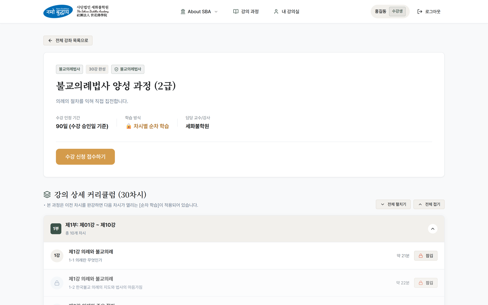
* 강좌의 커리큘럼(30차시), 담당 교수, 수강 인정 기간, 과목당 수강료(50,000원)를 한눈에 파악할 수 있습니다.
* **1~3강 무료 체험**: 수강 신청만 접수하면 결제 전에도 1~3강을 바로 시청할 수 있으며, 4강부터는 수강료 납부 및 승인 후 열립니다.

### 5.2 수강 신청 버튼 클릭 시
* `[수강 신청 접수하기]` 버튼을 클릭하면 **[수강 신청 완료]** 모달에 입금 계좌(농협 301-0264-3664-41, [사] 세화불학원)와 입금 금액이 안내됩니다.
* 신청자와 관리자에게 **수강 신청 접수 안내 문자**가 발송됩니다.
* 신청 즉시 학적 상태는 **[대기상태]**로 등록되며, 계좌 입금 또는 교학처(010-4702-0283) 방문 수납 후 관리자 승인을 통해 [수강 중]으로 전환됩니다.
* 입금 확인 및 수강 승인은 **매일 오전 10시~11시, 오후 6시~7시**에 진행됩니다.

---

## 6. 나의 강의실 (학습 대시보드)

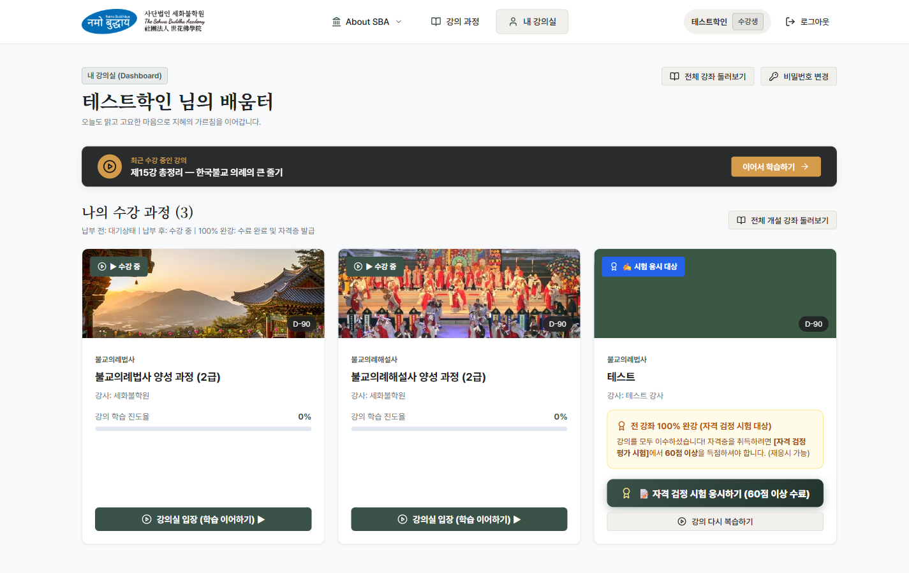

학인의 수강 이력과 자격증 취득 과정을 총괄 관리하는 개인 배움터입니다:
* **최근 수강 중인 강의**: 상단 배너의 `[이어서 학습하기 →]`를 누르면 마지막으로 보던 차시로 바로 이동합니다.
* **수강 신청 가능한 강좌**: 하단에 아직 신청하지 않은 강좌가 표시되어 내 강의실에서 바로 수강 신청할 수 있습니다.

1. **수강 중인 강좌**:
   * 강의 학습 진도율 프로그레스 바 실시간 표시
   * 잔여 수강 기간 D-Day 안내
   * `[강의실 입장 (학습 이어하기) ▶]` 버튼을 통해 마지막 시청 지점부터 바로 수강 가능
2. **수납 대기 강좌**:
   * 입금 계좌 및 승인 일정 안내 표시 (1~3강 무료 체험 가능)
3. **완강 및 자격 시험 응시 가능 강좌**:
   * 모든 차시를 **80% 이상** 시청하면 완강으로 인정되어 `[📝 자격 검정 시험 응시하기]` 버튼이 활성화됩니다.
4. **수료 완료 강좌**:
   * 시험 60점 이상 득점 시 `[🎓 정식 자격증 발급 및 출력]` 버튼이 제공됩니다.

| 대형 스마트폰 | 소형 스마트폰 |
| :---: | :---: |
| 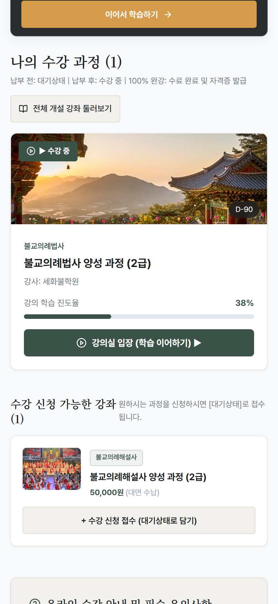 | 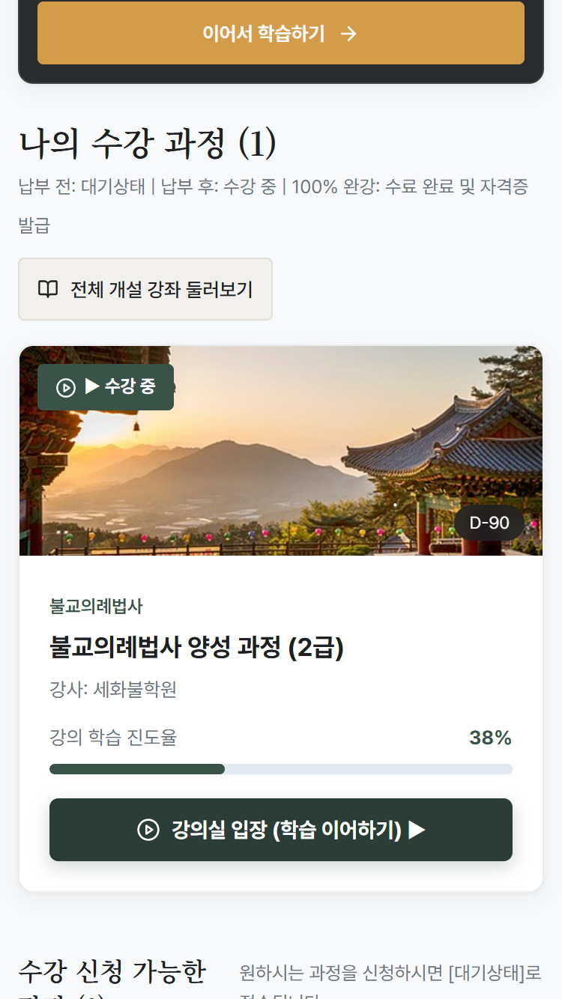 |

---

## 7. 스마트 VOD 플레이어 및 순차 학습 시스템

### 7.1 비디오 플레이어 인터페이스
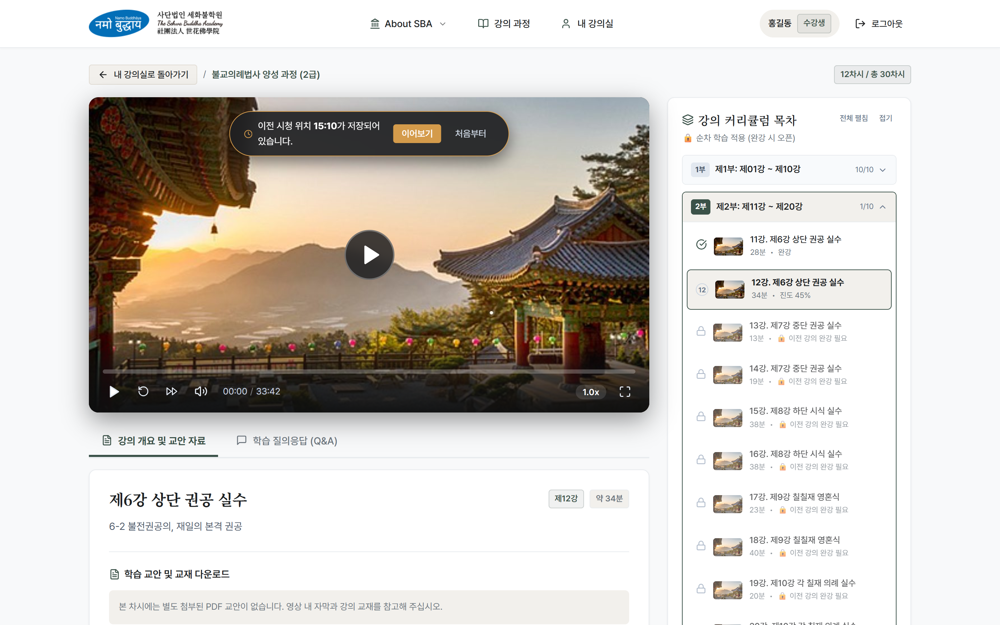

* **1080p Full HD 스트리밍**: 끊김 없는 고화질 영상 재생
* **플레이어 조작**: 재생/일시정지, 10초 뒤로·앞으로 이동, 음소거, 재생 속도(0.8·1.0·1.2·1.25·1.5배), 전체화면(ESC로 닫기)
* **이어보기 기능**: 학습자가 시청한 마지막 초(Seconds) 단위 위치가 자동 저장되어, 다시 들어오면 `[이어보기]` / `[처음부터]`를 선택할 수 있습니다.
* **교안 다운로드**: 차시에 첨부된 강의 교안 PDF 파일을 클릭 한 번으로 다운로드
* **단계별 순차 학습 시스템 (중요)**:
  * 앞 차시를 **80% 이상** 시청하면 다음 차시가 자동으로 잠금 해제됩니다.
  * 80% 이상 시청한 차시는 커리큘럼 목차에 **[완강]**으로 표시됩니다.
  * 잠긴 차시를 클릭하면 **[순차 학습 잠금 안내]** 모달 알림창이 나타납니다.

---

## 8. 학습 Q&A (지도 스님 / 교수 질의응답)

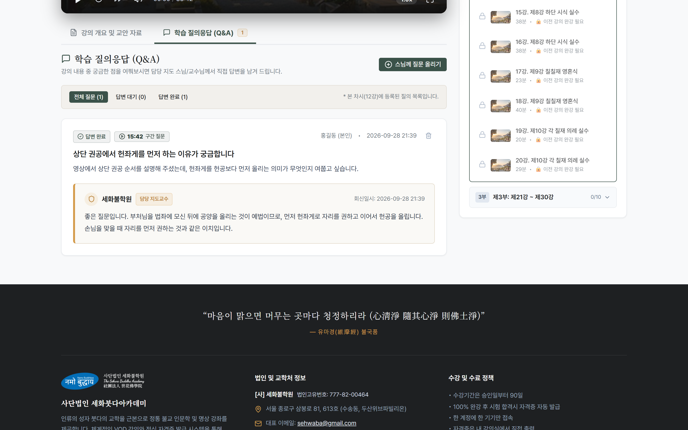

* **영상 타임스탬프 자동 연동**: 질문 작성 시 현재 시청 중인 비디오의 시간(예: `15:42`)이 질문에 자동 태깅되어, 해당 타임스탬프를 클릭하면 영상의 그 장면으로 즉시 이동합니다.
* **공식 답변 배지**: 담당 지도교수가 작성한 답변이 인증 배지와 함께 등록됩니다.
* **비밀글 옵션**: 개인적인 질문은 본인과 관리자만 열람할 수 있습니다.
* **문자 알림**: 새 질문이 등록되면 관리자에게, 답변이 등록되면 질문자에게 바로가기 링크가 담긴 안내 문자가 발송됩니다.

---

## 9. 자격 검정 온라인 시험 (20문항 실시간 응시 및 채점)

### 9.1 시험 안내 및 응시 자격
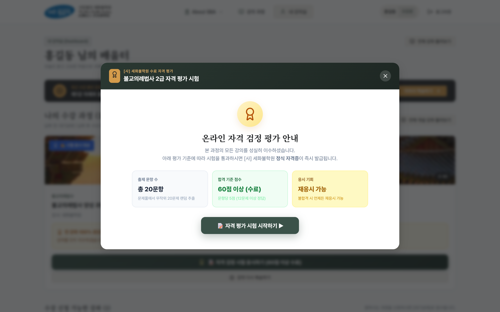
* 모든 차시를 80% 이상 시청한 학인에 한하여 응시 기회가 주어집니다.
* 코스별 문제 은행에서 **20문항이 무작위(Random)로 추출**되어 출제됩니다.
* **합격 기준**: 100점 만점 중 **60점 이상(12문항 이상 정답)**, 불합격 시 언제든 재응시 가능

### 9.2 실시간 시험 응시 화면
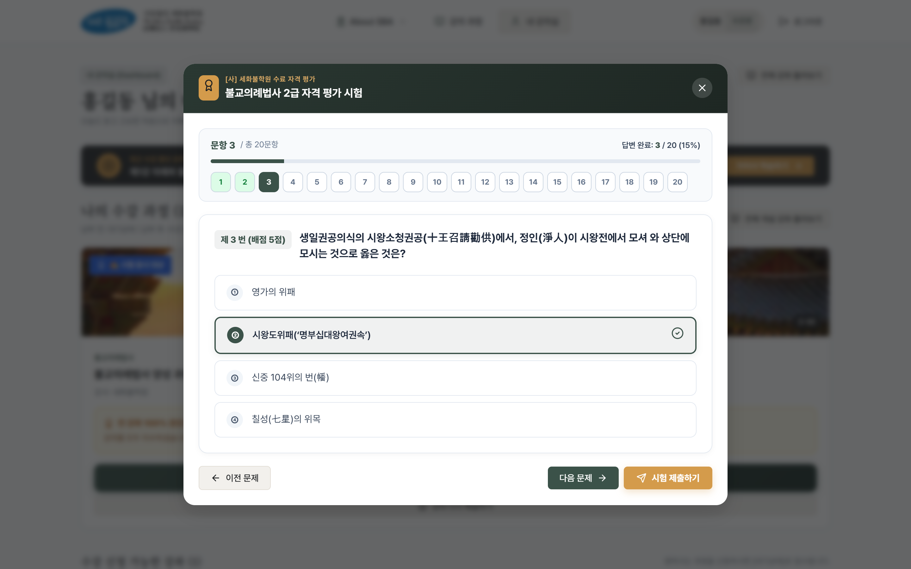
* 상단의 문항 번호 탐색기와 답변 진행률이 제공되며, 보기를 선택한 뒤 `[시험 제출하기]`를 누르면 즉시 자동 채점됩니다.

### 9.3 채점 결과 및 합격 축하
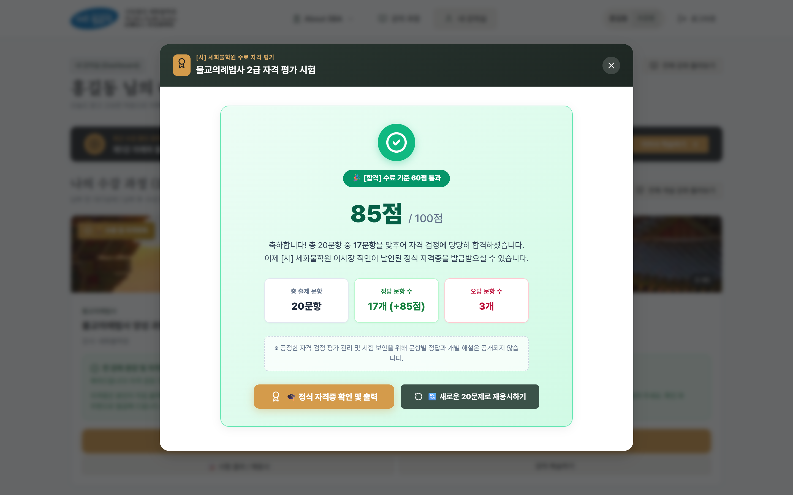
* 점수와 정답·오답 문항 수가 즉시 공개되며(문항별 정답과 해설은 비공개), 60점 이상 취득 시 `[🎓 정식 자격증 확인 및 출력]` 버튼이 활성화됩니다.
* `[새로운 20문제로 재응시하기]`로 다시 응시할 수 있습니다.

---

## 10. 공인 자격증 / 수료증 발급 및 PDF 인쇄

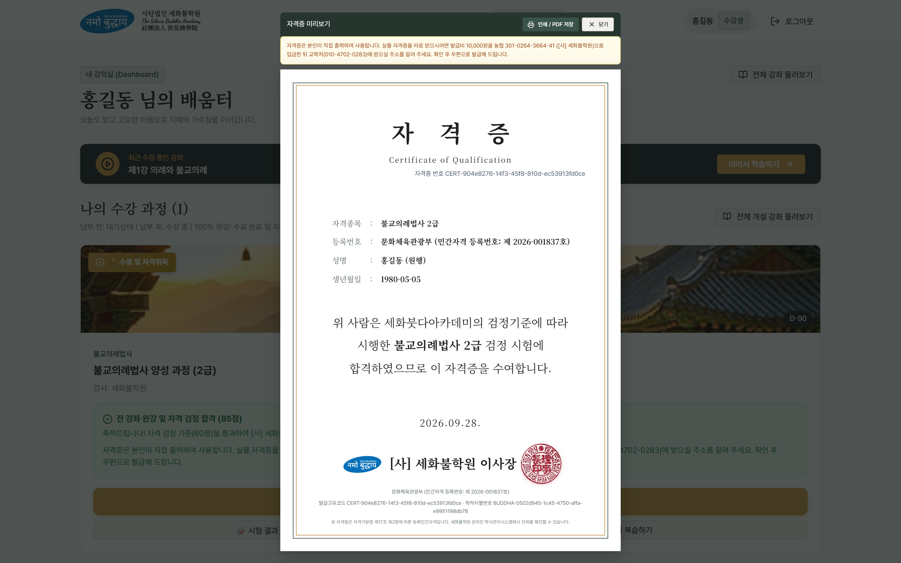

* **정식 공인 규격**: A4 세로 규격에 [사] 세화불학원 이사장 직인이 날인됩니다.
* **기재 사항**: 자격 종목 및 등급, 문화체육관광부 민간자격 등록번호, 성명(법명), 생년월일, 발급일, 발급고유코드, 학적식별번호
* **보안 기능**: 모든 자격증에 과정별 순번으로 고유 발급번호가 인쇄되며(불교의례법사 `CERT-LAW-2026-0001`, 불교의례해설사 `CERT-EXP-2026-0001` 형식), 진위 확인 포털(#verify)에서 조회할 수 있습니다.
* **인쇄 기능**: 상단의 `[인쇄 / PDF 저장]` 버튼을 누르면 브라우저 인쇄 창이 열리며, PDF 저장 시 파일명이 `자격종목_이름`으로 자동 지정됩니다.
* **실물 자격증 우편 발급**: 자격증은 본인이 직접 출력해 사용하며, 실물이 필요하면 발급비 10,000원을 농협 301-0264-3664-41([사] 세화불학원)로 입금한 뒤 교학처(010-4702-0283)에 받을 주소를 알리면 우편으로 발급됩니다.

---

## 11. 자격증 진위 확인 및 정품 인증 포털 (#verify)

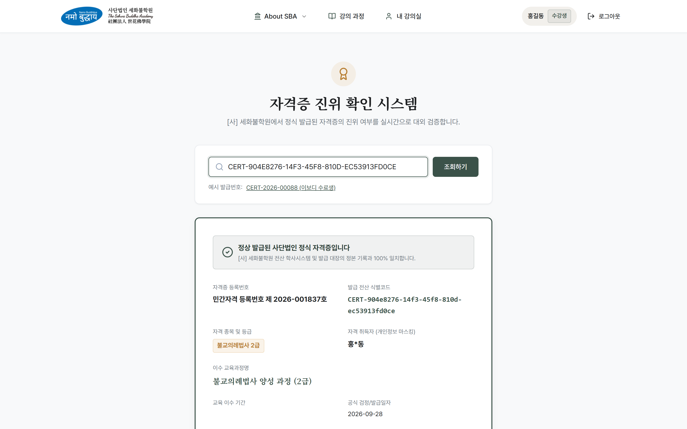

* 대외 기관, 사찰, 교육생 누구나 자격증 발급번호(예: `CERT-LAW-2026-0001`)를 입력하여 즉시 정품 인증 여부를 조회할 수 있습니다.
* 유효한 자격증인 경우 자격증 등록번호, 자격 종목 및 등급, 취득자 성명(개인정보 보호 마스킹), 이수 교육과정명, 발급일자가 표시됩니다.

---

## 12. 교학처 관리자 통합 시스템 (CMS)

관리자 계정으로 로그인 시 접속할 수 있는 학사 및 콘텐츠 총괄 관리자 패널입니다. 상단 탭은 `수강생 관리`, `수납 내역 장부`, `기부금 영수증`, `강좌·VOD 관리`, `학습 Q&A`, `자격증 발급`, `메인 공지`로 구성됩니다.

### 12.1 수강생 관리
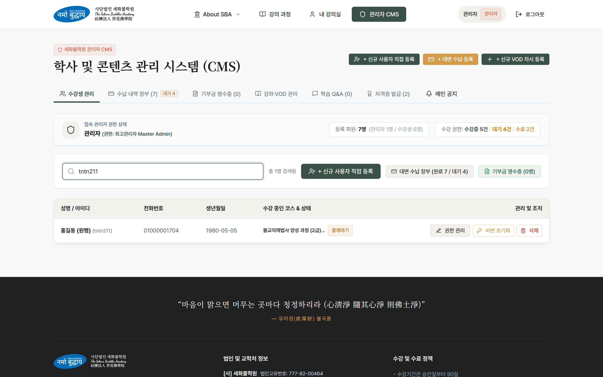
* 등록된 전체 학인을 이름, 휴대전화 번호, 아이디, 회원번호로 검색하고 수강 현황을 조회합니다.
* `[+ 신규 사용자 직접 등록]`: 교학처에서 학인 계정을 대신 만들고 임시 비밀번호를 안내합니다. 학번은 입력하지 않으며 등록 시 다음 순번이 자동으로 부여됩니다.
* `[권한 관리]`: 코스별 수강 상태를 `수강중`, `결제대기`, `수강신청 접수` 중에서 직접 변경합니다.
  * ⚠️ **권한 관리는 수강 상태만 바꾸며 수납 장부에는 기록되지 않습니다.** 수강료를 받은 경우에는 권한 관리 대신 `수납 내역 장부`의 `[수납 승인]` 또는 `[+ 대면 수납 등록]`을 사용해야 장부 기록과 수강 상태 전환(수강중)이 함께 처리됩니다.
* `[비번 초기화]`: 비밀번호를 분실한 학인의 비밀번호를 새 임시 비밀번호로 초기화합니다.
* `[삭제]`: 회원 계정을 삭제합니다. (관리자 계정은 삭제할 수 없음)

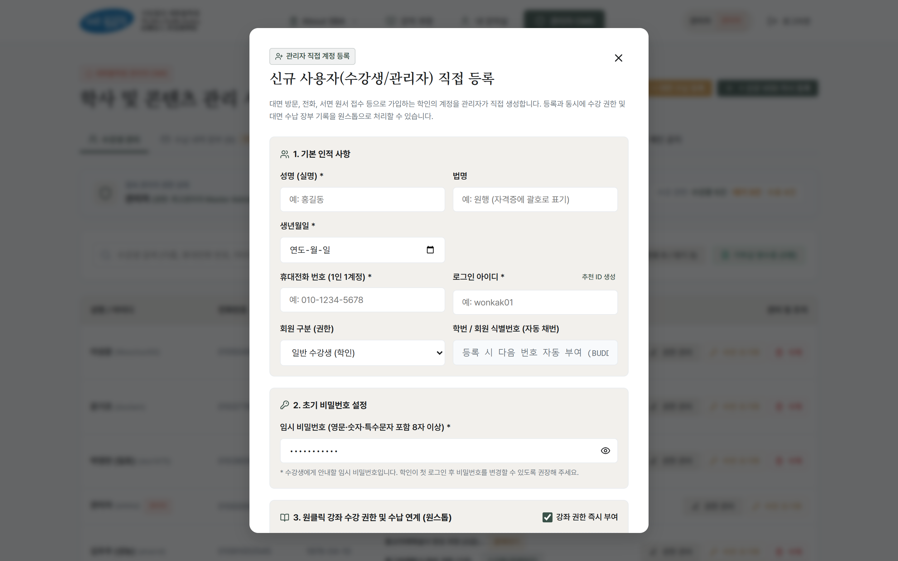

### 12.2 수납 승인 장부 및 기부금 영수증
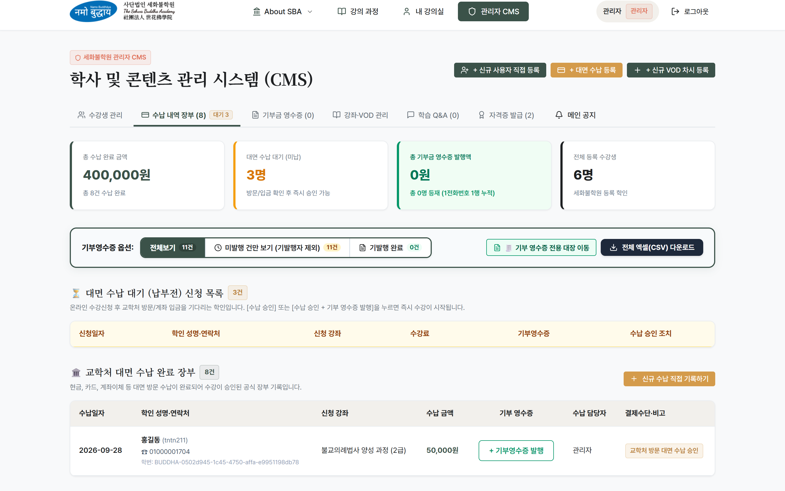
* 수납 대기 중인 학인 목록을 확인하고, `[수납 승인]` 버튼 클릭 한 번으로 수납 장부에 등재하며 학인의 수강 권한을 즉시 활성화합니다.
* `[수납 승인 + 기부 영수증 발행]`을 누르면 기부금 영수증을 함께 발행하며, 같은 전화번호의 납부액은 한 영수증에 누적됩니다.
* `[전체 엑셀(CSV) 다운로드]`로 선택한 조건의 장부를 엑셀에서 열 수 있는 CSV 파일로 내려받을 수 있습니다.
* `[+ 대면 수납 등록]` / `[+ 신규 수납 직접 기록하기]`: 온라인 신청 없이 교학처에서 받은 수납을 수강생·코스·금액을 골라 직접 장부에 기록하고 수강 권한을 부여합니다.
* 수납 승인·대면 수납 등록은 **장부 기록과 동시에 해당 학인의 수강 상태를 [수강중]으로 전환**합니다. 반대로 수강생 관리의 `[권한 관리]`로 상태를 바꾼 것은 장부에 남지 않습니다.
* `기부금 영수증` 탭에서는 발행된 기부금 영수증 대장을 따로 조회할 수 있습니다.

| 대면 결제 수납 등록 창 | 기부금 영수증 탭 |
| :---: | :---: |
| 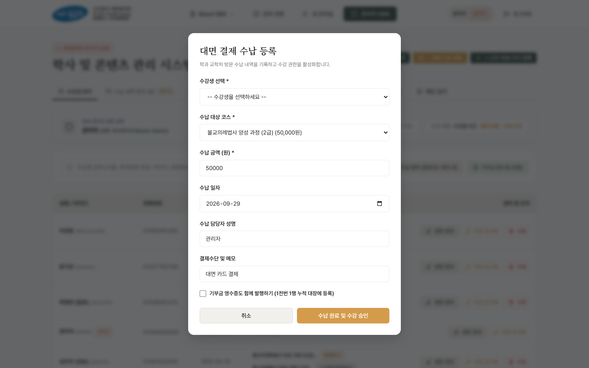 | 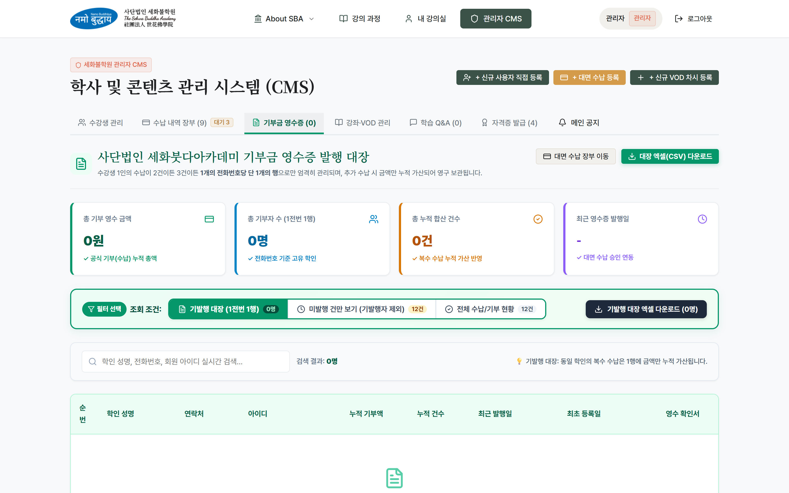 |

### 12.3 CMS 강좌·자격증 및 시험 문항 관리
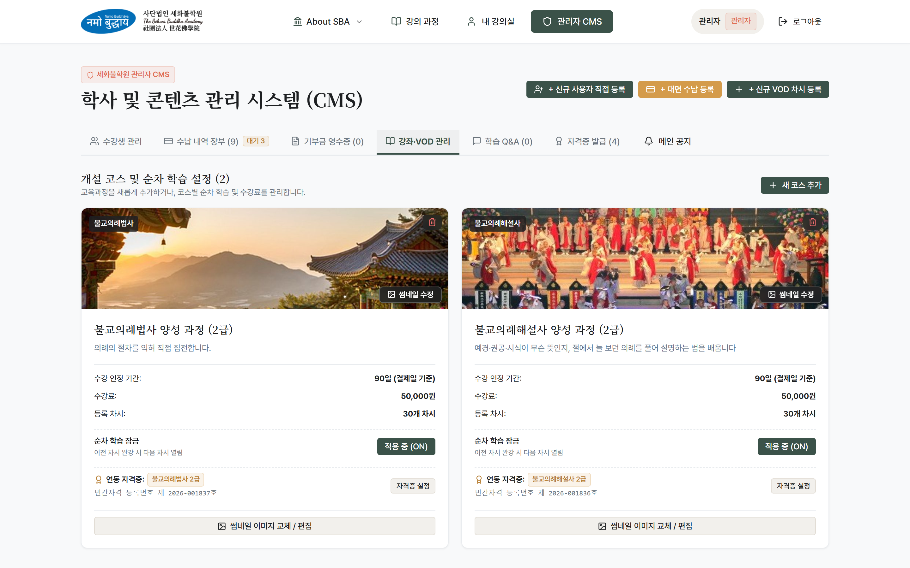

| 신규 VOD 차시 등록 창 | 자격증 설정 창 |
| :---: | :---: |
| 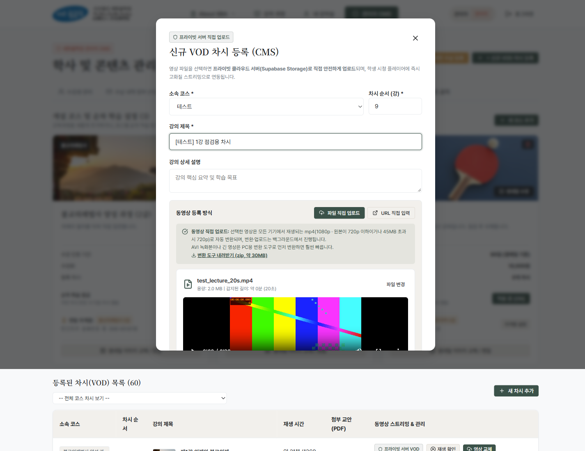 | 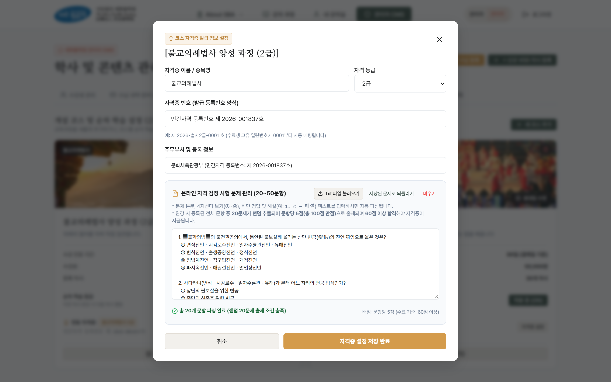 |

* **신규 코스 개설**: 코스명, 수강료(50,000원) 등 강좌 기본 정보 등록
* **자격증 설정**: 자격 종목·등급, 민간자격 등록번호, 시험 문항(20~50문항)을 텍스트로 일괄 등록 및 자동 파싱
* **차시 등록·영상 교체 (백그라운드 자동 처리)**: 영상 파일을 고르고 `[차시 등록 시작]` 또는 `[영상 교체 시작]`을 누르면 창이 바로 닫히고, 화면 왼쪽 아래 **[영상 처리]** 창에서 `호환 형식으로 변환 → 업로드 → 차시 적용`이 차례로 진행됩니다.
  * 모든 기기(구형 휴대폰 포함)에서 재생되도록 1080p·H.264 Level 4.0·30fps 호환 형식으로 브라우저가 자동 변환합니다(원본이 720p 이하이거나 45MB를 넘으면 720p). 이미 호환 형식인 파일은 변환 없이 바로 올라갑니다. AVI·MOV·MKV 등도 그대로 올릴 수 있습니다.
  * 처리하는 동안 다른 관리자 작업을 계속해도 되며, 여러 영상을 연달아 넣으면 순서대로 처리됩니다. 끝나면 완료 알림이 뜹니다.
  * ⚠️ **처리가 끝날 때까지 브라우저 탭을 닫지 마세요.** PC의 크롬 또는 엣지 최신 버전을 권장합니다.
  * **PC용 변환 도구**: AVI 녹화본이나 긴 영상은 브라우저 변환이 오래 걸리므로, 업로드 창의 `[변환 도구 내려받기]`(zip)로 PC에서 먼저 변환하면 훨씬 빠릅니다. 압축을 풀고 영상 파일을 `강의영상_변환.bat` 위로 끌어다 놓으면 `업로드용` 폴더에 호환 mp4가 만들어지며, 그 파일을 올리면 변환 없이 바로 업로드됩니다.
* **순차 학습 On/Off**: 코스별 순차 학습 잠금 원칙을 자유롭게 켜고 끌 수 있습니다.
* **차시별 관리**: 각 차시의 `[재생 확인]`, `[영상 교체]`, `[썸네일 수정]`, `[차시 삭제]`와 코스 썸네일 교체를 할 수 있습니다.
* **PDF 교안 첨부**: 차시별로 PDF 교안을 첨부할 수 있습니다.
* **코스 삭제**: 수강·수납·자격증 기록이 없는 코스만 삭제할 수 있습니다. (실제 장부 기록 보호)

### 12.4 질의응답 (Q&A) 통합 관리
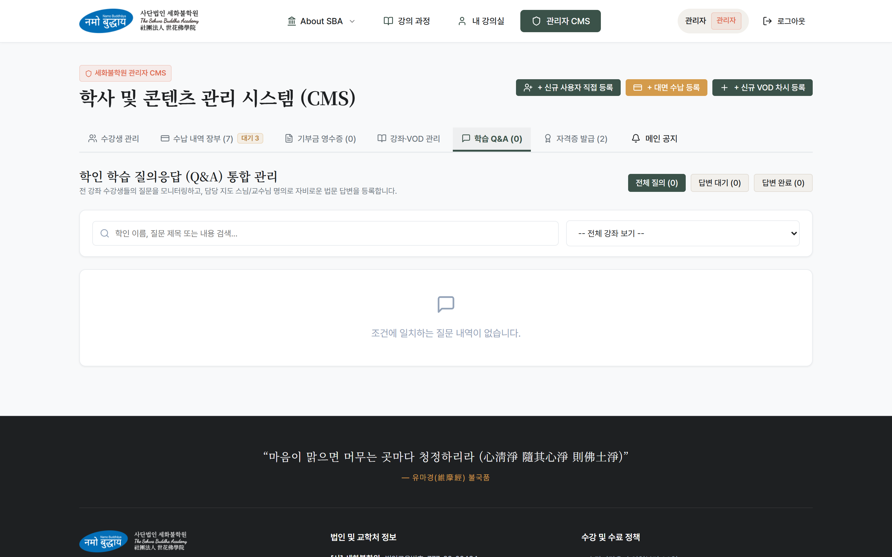
* 전체 강좌에 등록된 모든 학인의 질문을 모아보고 검색하며, 담당 지도 스님/교수님 명의로 답변을 작성하여 등록합니다.

### 12.5 자격증 발급 관리
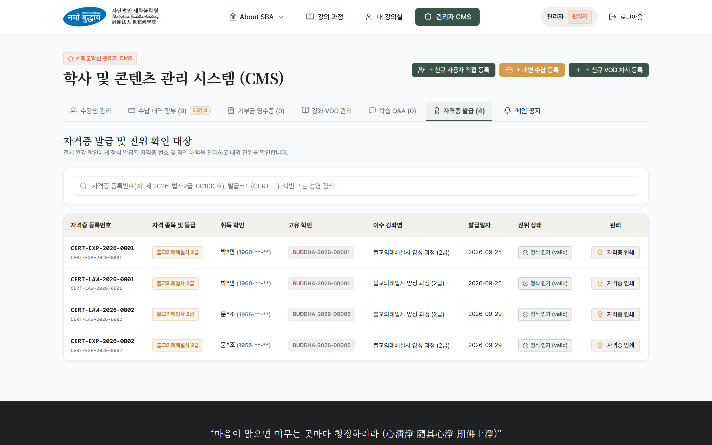
* `자격증 발급` 탭에서 발급된 전체 자격증을 등록번호, 발급번호(`CERT-LAW-…`/`CERT-EXP-…`), 학번 또는 성명으로 검색하고, 자격 종목·취득 학인·이수 강좌·발급일·진위 상태를 확인하며 `[자격증 인쇄]`를 할 수 있습니다.

### 12.6 메인 공지 팝업 관리
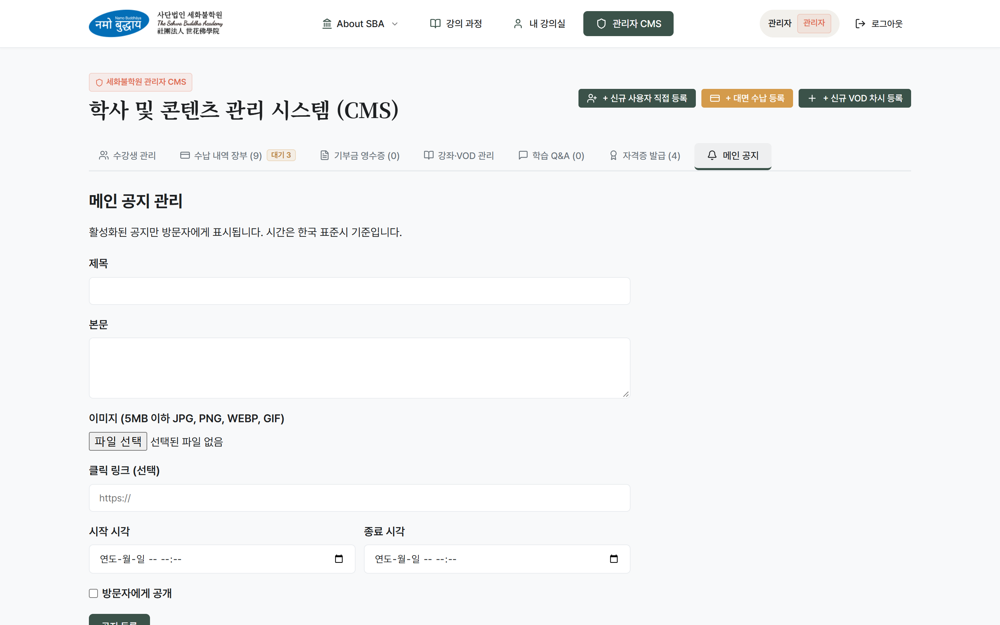
* 공지 제목·내용·이미지·링크와 게시 기간을 등록하고 `[방문자에게 공개]`를 체크하면, 게시 기간 동안 홈 화면 방문자에게 팝업으로 표시됩니다.
* 아래 `등록된 공지`에서 게시 중인 공지를 수정·삭제합니다.

---

## 13. 시스템 전수 모달 알림창(Alert / Confirm) 도감

기존 브라우저의 투박한 회색 `alert()` 창을 전면 제거하고 세화붓다아카데미 전용 디자인 토큰으로 맞춤 제작된 커스텀 모달 알림창 도감입니다:

| 구분 | 모달 명칭 및 역할 | 화면 미리보기 |
| :---: | :--- | :---: |
| **01** | **수강 신청 완료 (성공)** 입금 계좌·금액·승인 일정 안내 | 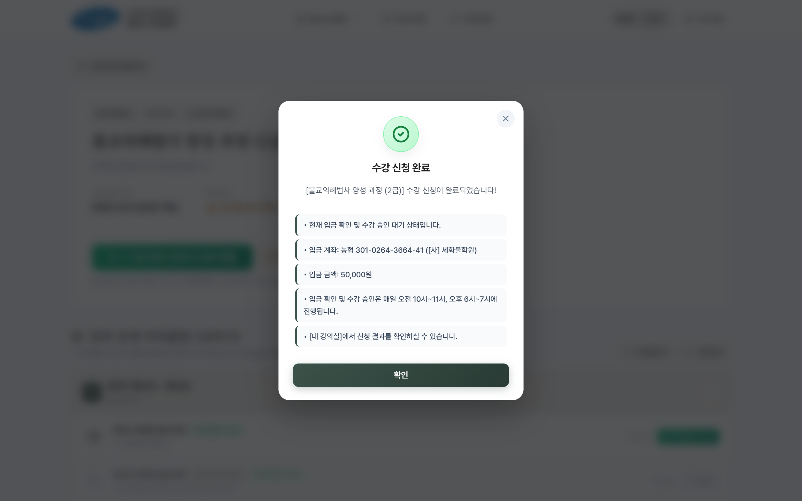 |
| **02** | **순차 학습 잠금 안내 (경고)** 이전 차시 미완강 시 다음 차시 수강 제한 | 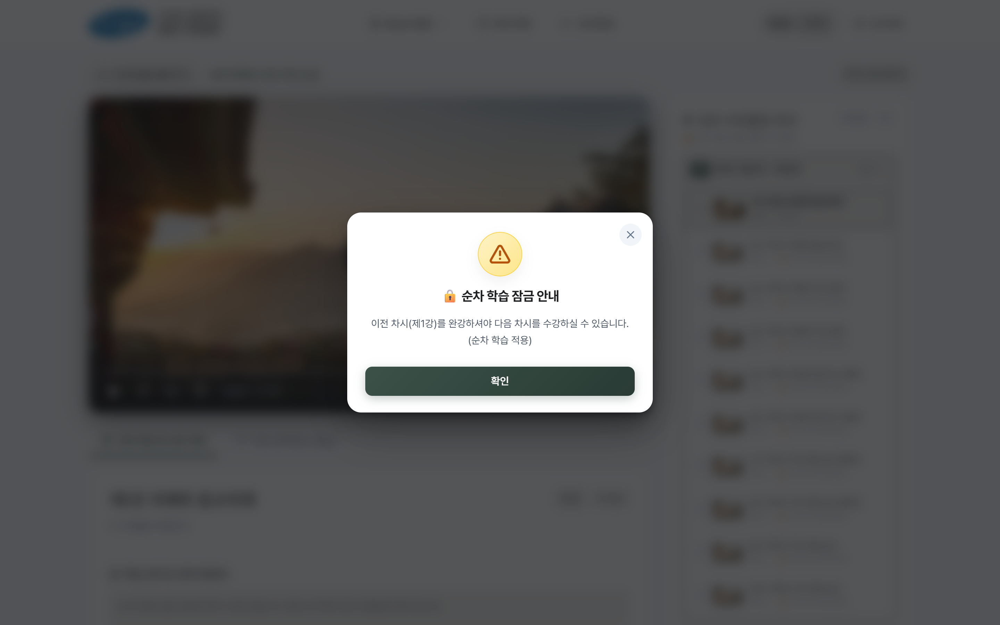 |
| **03** | **교안 다운로드 안내 (정보)** 차시별 실무 교안 PDF 다운로드 안내 | 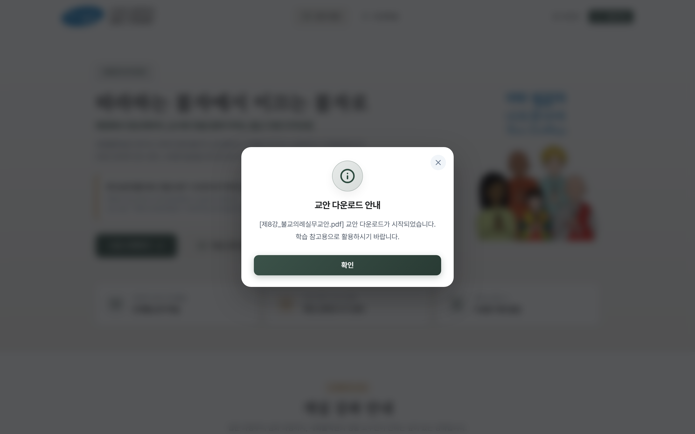 |
| **04** | **로그인 및 인증 오류 (오류)** 비밀번호 불일치 및 접근 권한 제한 안내 | 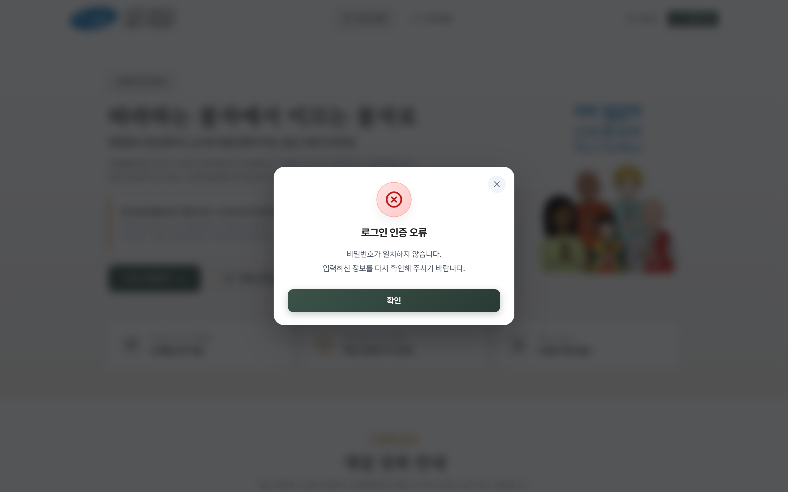 |
| **05** | **대면 수납 승인 확인 (컨펌)** 교학처 관리자 수납 승인 및 장부 등재 컨펌 | 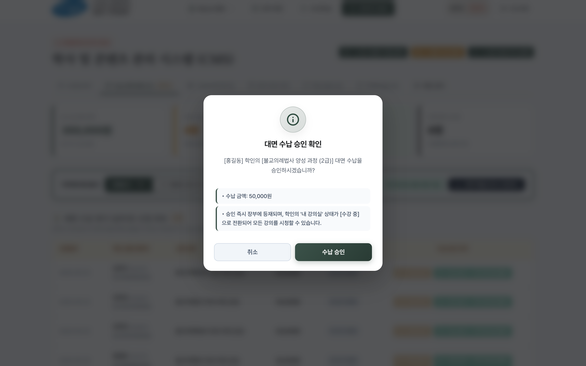 |
| **06** | **차시 영구 삭제 확인 (컨펌)** 강의 차시 및 스트리밍 연결 삭제 컨펌 | 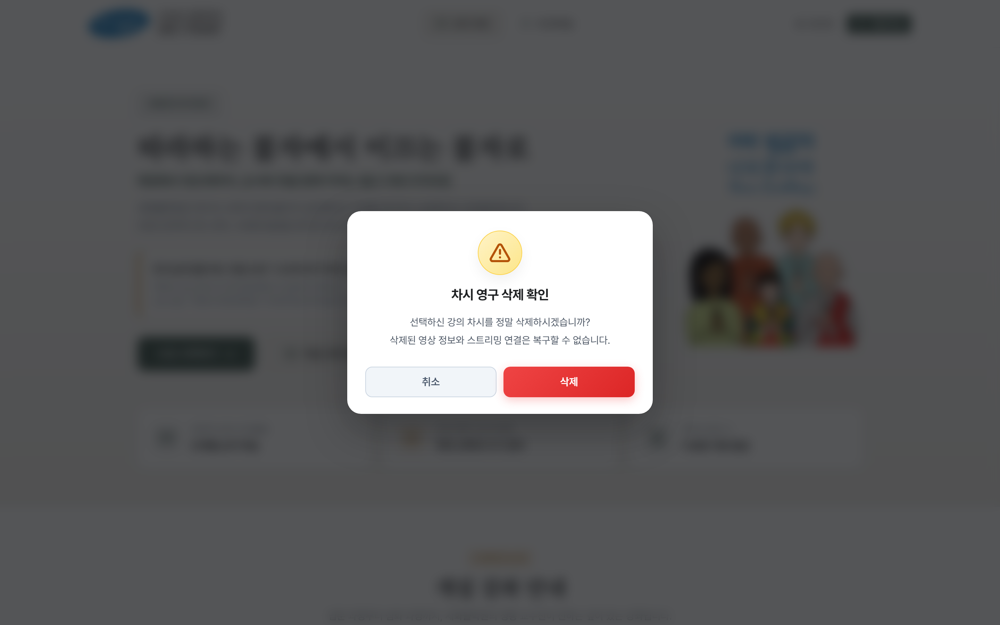 |
| **07** | **비밀번호 초기화 완료 (성공)** 학인 계정 비밀번호 초기화 완료 안내 | 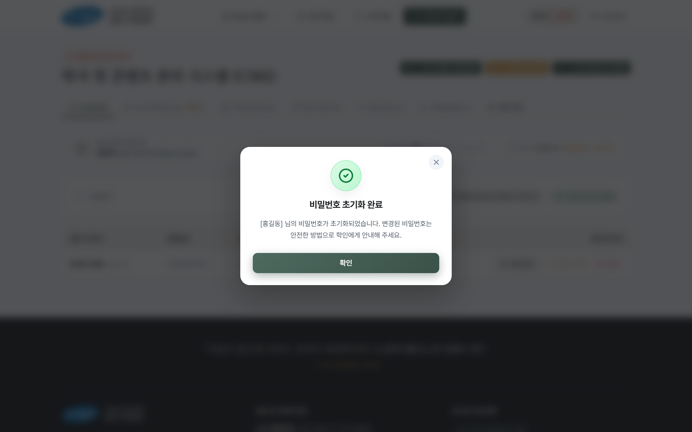 |
| **08** | **자격증 및 시험 문항 설정** 자격증 발급 정보 및 시험 문항 저장 |  |

---
*문서 작성일: 2026년 9월 16일 (최종 수정: 2026년 9월 28일) | [사]세화붓다아카데미 교학처 교육정보원*
